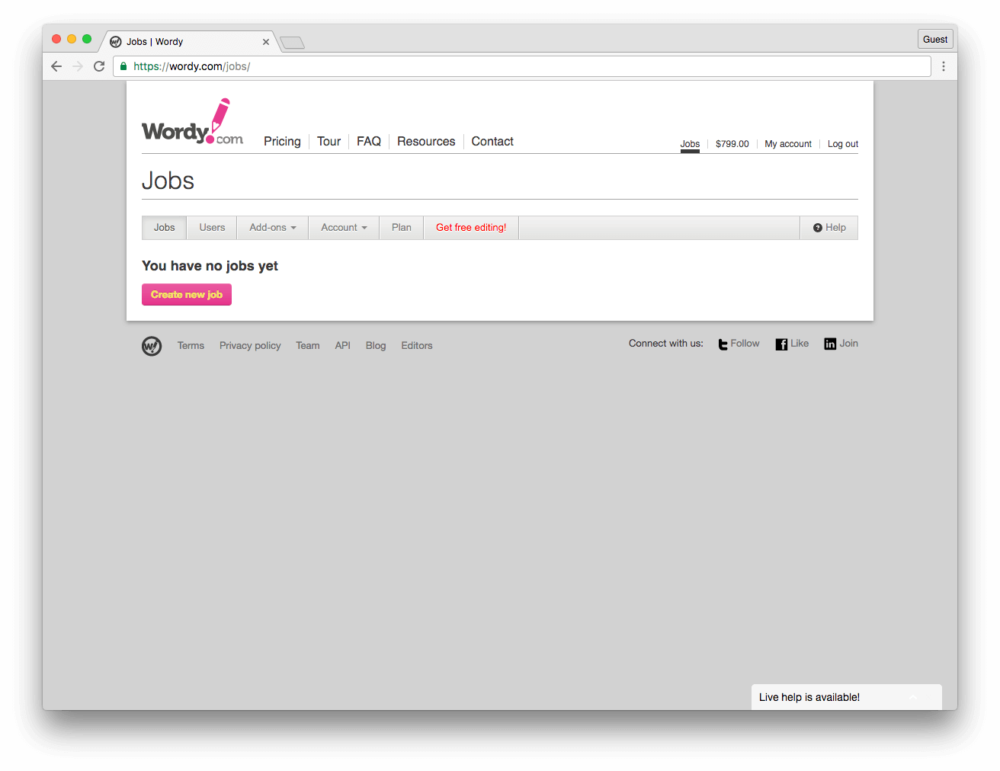

# Contributing to Auth0 Documentation

:+1::tada: First off, thanks for taking the time to contribute! :tada::+1:

The following is a set of guidelines for contributing to the Auth0 documentation. These are just guidelines, not rules, use your best judgment and feel free to propose changes to this document in a pull request.

## Table of Contents

* [General Guidelines](#general-guidelines)
* [Reusing Content](#reusing-content)
* [Markdown](#markdown)
  * [Headings](#headings)
  * [UI Components](#ui-components)
  * [HTTP Request Snippets](#http-request-snippets)
  * [Escaping Strings](#escaping-strings)
  * [Image zooming](#image-zooming)
  * [Screenshots](#screenshots)
  * [Front Matter](#front-matter)
  * [Linting](#linting)
* [Sidebar](#sidebar)
* [Beta Content](#beta-content)
* [Finishing](#finishing)
* [Editing with Wordy](#editing-with-wordy)
* [Test Procedures](#test-procedures)
* [Review Apps](#review-apps)
* [Quickstarts](#quickstarts)
  * [Creating Quickstarts](#creating-quickstarts)
  * [Versioning Quickstarts](#versioning-quickstarts)
  * [Quickstart Guidelines](#quickstart-guidelines)
  * [Seed Projects](#seed-projects)
* [Updates Feed](#updates-feed)
* [API](#api)
* [Code snippets](#code-snippets)
* [Document Front-matter](#document-front-matter)
* [Document Variables](#document-variables)
  * [Common Variables](#common-variables)
  * [User Specific Variables](#user-specific-variables)
* [Versioning](#versioning)

## General Guidelines

* Read and follow the [Style Guide](STYLEGUIDE.md).
* Consult the [Words](WORDS.md) document for Auth0 specific spellings and definitions.
* Always use relative URLs for internal `auth0.com/docs` links. For example, if the absolute path to the document is `https://auth0.com/docs/identityproviders`, use `/identityproviders`. These links will be correctly formatted in the build process.
* Do not hard code links to Auth0 sites like `docs.auth0.com` or `manage.auth0.com`. Instead, use [Document Variables](#document-variables), such as `${manage_url}`.
* Name files with all lowercase using dashes (-) to separate words. If using a date in the file name, it should be in the format YYYY-MM-DD. For example, `this-is-my-file.md` or `this-is-a-title-2015-10-01.md`.
* Do not store images in external locations like Dropbox, CloudUp, or the Auth0 CDN. Link to images in this repo using a relative path ``. The image will be uploaded to the CDN and the link will be formatted during the build process. Do not forget to set the alternate text for each image.
* Keep images to no more than 750 pixels wide.
* Screenshots of the Auth0 dashboard including the browser window with dropshadow can be up to 900 pixels wide to maintain legibility.
* Run all images through [TinyPNG](https://tinypng.com/).

## Reusing content

To avoid duplication of content, you can create document fragments to be referenced from other documents. The process of including another document is shown below.

First, create your fragment document. The convention is to name fragments with an underscore, like: `_mydocument.md`.

After you create your markdown document, you can reference it in another document with a relative path:

```markdown
<%= include('../_mydocument.md') %>
```

Additionally, you can send variables to the included document:

```markdown
<%= include('../_mydocument.md', { key: 'value', something: true }) %>
```

## Markdown

Markdown on this site conforms to the [CommonMark](http://commonmark.org/) spec. Additionally, there are a few custom Markdown features available as described below.

You should [test your Markdown](http://markdownlivepreview.com) to ensure the formatting is correct.

### Headings

Add one to six `#` symbols before your heading text to create your header. The number of # you use determines the size of the heading.

```
# H1
## H2
### H3
#### H4
##### H5
###### H6
```

The header text above renders as follows:

# H1
## H2
### H3
#### H4
##### H5
###### H6

One common mistake with formatting of headings is to not include a space between the hashes and the text. Some Markdown processors allow this, but we do not. You must put a space as shown below.

INVALID: `#My Heading`

VALID: `# My Heading`

### UI Components

General advice:
- Do not add custom UI components with HTML unless it's really necessary.
- Do not add any element before the main title. If you want to show some general information for the whole doc put the element after the main title.
- Try to keep the amount of UI components on your docs to a minimum. They make the documentation more difficult to read and cut the reading flow.
- Only use the `blockquote` element (`>` in markdown) to represent actual quotes. Use a `note` or a `panel` if you want to highlight the information.

#### Note

Use this component if you want to display some extra information, links to related content or clarifications.

Only use this if the content is brief (one to four lines), if not use the `panel` component.

```markdown
::: note
If you need a refresher on the OAuth 2.0 protocol, you can go through our <a href="/protocols/oauth2">OAuth 2.0</a> article.
:::
```


#### Warning

Use this component if you want to notify that the content is deprecated, there is a security issue or to highlight some **very important** information.

Only use this if the content is brief (one to four lines), if not use the `panel-warning` component. It's recommended to keep the copy of the warnings short and clear.

```markdown
::: warning
Long-lived tokens compromise your security. Following this process is <strong>NOT</strong> recommended.
:::
```


#### Panels

Use panels when you want to separate long information from the main body of the document.

Try to add a meaningful title to the panel. Avoid using "NOTE" or "WARNING".

We support two types of panels: **panel** and **panel-warning**.

##### Panel (default)

```markdown
::: panel Title
Description
:::

::: panel Enable APIs Section
If you can't see the [API section](${manage_url}/#/apis) in the left hand menu of the dashboard then you will have to enable it. Navigate to your [Account Advanced Settings](${manage_url}/#/account/advanced), scroll down to the *Settings* section and toggle the **Enable APIs Section** switch.
:::
```


##### Panel (warning)

```markdown
::: panel-warning Title
Description
:::

::: panel-warning Security Warning
It is important to understand that the Authorization Code flow should only be used in cases such as a Regular Web Application where the Client Secret can be safely stored. In cases such as a Single-Page Application, the Client Secret is available to the client (in the web browser), so the integrity of the Client Secret cannot be maintained. That is why the [Implicit Flow](/flows/concepts/implicit) is more appropriate in that case.
:::
```


##### Next steps list

Use this container to mark a Next to read/Continue reading list of links.

Try to keep the list length to a minimum (up to 5 links).

```
::: next-steps
* [Access Token](/tokens/access-token)
* [ID Token](/tokens/id-token)
* [OpenID Connect Overview](/protocols/oidc)
:::
```


### HTTP Request Snippets
You can add a [HAR request format](http://www.softwareishard.com/blog/har-12-spec/#request) snippet to make an example HTTP request available in a variety of languages. This will generate a tab view showing the HTTP request in various languages.

The library we use is [HTTP Snippet](https://github.com/Kong/httpsnippet).

**NOTE:** You need to set the language type to `har` for this to work. View this raw markdown document for an example.

```har
{
    "method": "GET",
    "url": "http://www.example.com/path/?param=value",
    "httpVersion": "HTTP/1.1",
    "cookies": [],
    "headers": [
      { "name" "Authorization", "value": "Bearer ABCD" }
    ],
    "queryString" : [],
    "postData" : {
      "mimeType": "application/json",
      "text" : "{ \"test\": \"foo\" }",
    },
    "headersSize" : 150,
    "bodySize" : 0,
    "comment" : ""
}
```

* method [string] - Request method (GET, POST, ...).
* url [string] - Absolute URL of the request (fragments are not included).
* httpVersion [string] - Request HTTP Version.
* cookies [array] - List of cookie objects.
* headers [array] - List of header objects.
* queryString [array] - List of query parameter objects.
* postData [object, optional] - Posted data info. See: <http://www.softwareishard.com/blog/har-12-spec/#postData>
* headersSize [number] - Total number of bytes from the start of the HTTP request message until (and including) the double CRLF before the body. Set to -1 if the info is not available.
* bodySize [number] - Size of the request body (POST data payload) in bytes. Set to -1 if the info is not available.
* comment [string, optional] (new in 1.2) - A comment provided by the user or the application.

### Escaping Strings

Occasionally you will need to use strings that contain the characters that are used for template replacement. The examples of this are `${example}`, `<% example %>` and `<%= example %>`. If you try to include these in your doc or a code snippet the document will fail to render because our template engine will try to replace your variable, i.e. `example`. However, you can include these by escaping them as shown below.

Change `${example}` to `<%= "${example}" %>`.

Change `<%= example %>` to `${ "<%= example %>" }`.

Change `<% example %>` to `${ "<% example %>" }`.

### Image zooming

You can enable zooming adding the `zoomable` data attribute to any image tag in html:


```html

```

It's recommended to add this only for large images (like diagrams) and use it with .svg images.

### Screenshots

On Mac OS X screenshots of the Auth0 interface need to be taken with Chrome, taking into account the following:

 1. The browser cannot show any plugins, customizations, or bookmarks.
 1. The browser cannot be in incognito mode.
 1. The browser should have only one tab open, the one in the screenshot.
 1. The browser needs to be resized to the standard size. Using the below script:

  ```bash
  osascript -e 'tell application "Chrome" to set the bounds of the front window to {100, 150, 1200, 900}'
  ```
 1. Auth0 screenshots should capture the complete browser window (**Command + Shift + 4**, then press **Space**).
 1. Use color **#0099CC** for highlights.
 1. Resize image to a maximum 1500px width.

 Example:

 

 **NOTE**: When you use the `Command + Shift + 4 + Space bar` shortcut Mac adds a drop shadow to your screenshot. This is normal and you don't have to remove it.

#### Mobile Screenshots

For mobile screenshots you should use the [Phone Mockup](http://styleguide.auth0.com/#phone-mockup) component from styleguide.

#### Close-ups

The exception to showing the full browser window is for highlighting a detail as part of a tutorial, for example, to show a field requiring input.

It is often best to shrink the screenshot slightly to avoid having the image of the UI be mistaken for the actual UI.

#### Borders

For close-ups and other screenshots that do not include the browser window, apply a 1px centered border (**select all > edit > stroke**) of color **#cccccc** to keep the image from blending with the background and appearing to float.

### Front Matter

You can set various properties of articles in the front matter of the document. Each document should have the `title` and `description` properties set. You can set other variables depending on the document.

`toc` adds a table of content dropdown at the top of the document, that lists all the paragraphs of the doc. By default it is disabled. Set it to `true` to display the dropdown.

Example front matter:

```yaml
---
title: My Document
description: This is a document
toc: true
---
```

#### URLs

Document urls are by default in the same format as the folder structure after the `articles` folder. So for example if you document is stored at `articles/my-folder/document.md`, the url would be `/docs/my-folder/document`.

If you create a folder that will have multiple articles, the best practice is to set the default document as `index.md`. However, the url must be set in that document to a friendly url. For example, if you have a document `/articles/my-folder/index.md`, you should set the url to be `/my-folder`.

URL Front Matter

```yaml
---
url: /path/to/document
---
```

### Linting

We use a pre-commit hook that lints the edited files to ensure a consistent style in the docs.
We use [markdownlint](https://github.com/DavidAnson/markdownlint) with the rules specified in the `.markdownlint.json` file in the root of the repo to do this. You can [check more about the linting rules](https://github.com/DavidAnson/markdownlint/blob/master/doc/Rules.md).

You will not be able to commit if your edited file does not follow these guidelines.

If you are using VS Code as your code editor, it is highly recommended to install the [MarkdownLint VS Code Extension](https://marketplace.visualstudio.com/items?itemName=DavidAnson.vscode-markdownlint).

## Sidebar

When you are adding a new article you should always add a link to it in the `config/sidebar.yml` file.
It is really important to represent all our articles in the sidebar because this will help the user see where they are inside the documentation.

You can add titles to the sidebar using the attribute `category`:

```
- title: "Title text"
  category: true
```

You can hide an article from the sidebar with the `hidden` key:

```
- title: "Title text"
  hidden: true
```

You can nest articles with the `children` key:

```
  - title: Getting Started
    url: "/getting-started"
    children:
      - title: Auth0 Overview
        url: /getting-started/overview
      - title: The Basics
        url: /getting-started/the-basics
```


## Beta Content

To mark a doc as Beta set this metadata:

```
beta: true
```

This will add a `Beta` button next to the header.

## Finishing

Prior to submitting your pull request, please check and edit your work. You should:

* Edit your text using [Wordy](#editing-with-wordy);
* Run through [testing procedures](#test-procedures);
* [Build a review app](#review-apps) (if necessary) to ensure that the build will success once your changes are merged.

## Editing with Wordy

Prior to submitting a pull request, please have your work edited by [Wordy](http://wordy.com).

To create and submit a job to Wordy:

1. Have your content ready in a common file format, such as `.doc`, `.rtf`, `.txt`, `.pdf`, `.xls`, `.html`, or `.tex`. You may also choose to paste in your text.
2. Log in to Wordy.
3. Under the **Jobs** page, click on **Create New Job**.

  

4. Provide the requested information so that your editor is clear on what needs to be done.


You will need to provide the following pieces of information:
* **Language**: Set to *English (US)*.
* **Content rewrite**: Select this option if you are okay with your editor rewriting your text for improved flow and natural use of language. If this option is *not* selected, your editor will simply check for spelling, grammar, punctuation, consistency, and structure.
* **Brief to editor**: Provide any information you would like your editor to keep in mind when editing your work. For a starter snippet, please see our sample on [Notes to Wordy Editors](wordy-guide.md)
* **Save my brief and language settings for future jobs**: Select this box to persist your chosen settings.
5. Upload files. You may choose to upload external files containing your text or paste in the text you want edited.
6. After you have completed the above steps, you will get an instant price quote and an approximate delivery time for your job. If this is acceptable to you, click on **Create Job** to begin the editing process.

### Word Count and Wordy Submissions

Wordy charges based on total word count, which includes code snippets. If possible, remove code snippets prior to submitting your document to Wordy.

### Instructions for Editors

It is helpful to include some instructions for the Wordy editors to let them know that the articles may have words that seem out of place because the article is about technology.

**NOTE**: Please edit for spelling and grammar. Audience consists of programmers and technology readers. Grammar, casing, spelling etc will seem weird in some cases, especially with uses of the word "this", but chances are that those are cases of programming jargon or naming. The final article will include code snippets that have been removed from the text for brevity. Instead, a placeholder called CODE_SNIPPET has been used.

### Notes

* You can cancel a job if it has not been picked up by an editor. If the job has been picked up, you can contact the editor and request a cancellation, though it is at the editor's discretion whether or not to cancel the job.
* During the editing process, you can contact your editor from the job's page. You can include last-minute instructions, corrections, and so on. Conversely, your editor can contact you during the process if they have any questions about your text. You will be notified by email if you receive any messages.
* If you are unsatisfied with the work completed by your editor, you can send your work back. This includes issues where you find errors in the text or the instructions in your brief haven't been followed. You can contact your editor by using the **Conversation History** feature on the job's page.

## Test Procedures

When testing a document or tutorial:

1. Ensure that the code in the tutorials is correct and functions as expected.
1. Ensure that the steps (1..n) are in an order that makes sense and that there are no missing or duplicate steps.
1. Check for broken links.
1. Check for outdated screenshots of the Auth0 dashboard or product and third-party sites.
1. Ensure that the code in the seed project download functions as expected.
1. Check for outdated dependencies, both Auth0 dependencies and third-party (i.e. node modules, nuget packages, gems, etc.).

## Review Apps

If you have access to the Auth0 Heroku account, you can create a preview release for your pull request:

1. Login to Heroku and open the `auth0-docs-content` pipeline.
2. Find the Review App for your pull request and click the **Create Review App** button.
  
3. Once the app begins deployment, you will see the status of your PR updating. The deployment takes about 5 minutes.
  
4. Once the deployment completes, you will see the status change. You can click the link in the PR to open the preview site.
  

## Quickstarts

### Creating Quickstarts

All quickstart data comes directly from the docs API at `/meta/quickstart`. This means that the quickstart on docs and manage will both consume the same datasource and will always be up-to-date. To add a new quickstart, create a folder with the name of the quickstart in the appropriate folder: [server-apis](/articles/server-apis), [server-platforms](/articles/server-platforms), [native-platforms](/articles/native-platforms), or [client-platforms](/articles/client-platforms). Inside that folder you will need to create an `index.yml` file that contains the following:

```yaml
---
title: Quickstart Name
image: //cdn.auth0.com/path/to/icon.png
logo_name: name # Optional, for overriding the logo used to display the quickstart. Use the data-name attribute for the badges here: http://styleguide.auth0.com/#resources
thirdParty: true|false  # For server apis only
hybrid: true|false # For native platforms only
snippets:
  dependencies: folder/dependencies.html
  setup: folder/app.js
  use: folder/login.js
articles:
  - 00-Intro
  - 01-Login
---
```

For each quickstart, you must specify the snippets and create the associated snippet file in the `/snippets` folder. You must provide all three snippets for each quickstart: `dependencies`, `setup`, and `use`. To include the snippet in the quickstart document simply reference it as follows:

```md
${snippet(meta.snippets.use)}
```

**NOTE:** You only need to use these three snippets. The rest of the quickstart snippets should be inlined unless you are sharing them.

For each article inside a quickstart you create a markdown file for the article as well as add it to the `articles` list in the `index.yml` file.

The markdown for a quickstart article is of the normal format. You must specify the following front matter for every article:

```yaml
---
title: Title
description: The article's description
---
```

The `title` will generally be a single word like Introduction or Login as it will be contacted when displayed.

After you publish the doc update, the new quickstart will automatically appear on both docs and manage.

#### Hiding Articles in Navigation

Articles are included in navigation by default.  To hide an article from navigation,
modify the `index.yml` and move the article from `articles` to `hidden_articles`.

```yaml
articles:
  - 00-Intro
  - 01-Login
hidden_articles:
  - Hidden-Article
```

### Quickstart Guidelines

Each framework will have a set of articles that comprise the quickstarts. The set of articles each framework will have depends on the function of each. Below is an outline of the documents that should be created for each framework.

#### Library References

Each library that we publish should have appropriate reference documentation. There will be two kinds of reference documentation for each library. The first is automatically generated. Each library should generate reference docs using a tool like jsDocs on every build/release. This will ensure consistent and up to date documentation.

Additionally, many libraries may also need manual documentation showing more sophisticated scenarios. Certainly, Auth0.js and Lock will need significant manual documentation. Other libraries will as needed.

#### Quickstarts Articles

Each framework will have a set of articles that comprise the quickstarts. The set of articles each framework will have depends on the function of each. Below is an outline of the documents that should be created for each framework.

##### Native

0. Intro - Introduction and summary of what the quickstart is about and a Table of Contents
1. Login - Shows how to create an auth0 application, add the login widget to your code, setup everything, and perform a login.
2. Login with Custom UI - Using head-less library to do login without Lock
3. Session Handling - How to store tokens, Refresh Tokens, and logout
4. User Profile - How to access the user profile from within the app. The core concepts of this are how to retrieve profile data as well as any claims that are present in the token.
5. Linking Accounts - How to link two accounts using both the lock widget or using the API manually.
6. Rules - Using rules to change what is in the token. This document is likely shared with all quickstarts[a].
7. Authorization - How to pull scope or other access control claims from the token and use those claims to authorize a user to perform certain actions in the application.[b]
8. Calling Your API - How to take the Access Token from
9. MFA - how to add MFA to your app. This should probably be a single document that is shared with all native apps[c].
10. Customizing Lock - Document explaining the basics of how to custom lock. There are full documents about this as well that show the complete details.

##### Web

0. Intro - Introduction and summary of what the quickstart is about and a Table of Contents
1. Login - Shows hot to create an auth0 application, add the login widget to your code, setup everything, and perform a login.
2. Login with Custom UI - Using auth0.js to build a custom login without Lock.
3. Session Handling - How to store tokens, how to handle sessions (serialization, etc.), and logout
4. User Profile - How to access the user profile from within the app. The core concepts of this are how to retrieve profile data as well as any claims that are present in the token.
5. Linking Accounts - How to link two accounts using both the lock widget or using the API manually.
6. Rules - Using rules to change what is in the token. This document is likely shared with all quickstarts.
7. Authorization - How to pull scope or other access control claims from the token and use those claims to authorize a user to perform certain actions in the application.
8. Multi-factor Authentication - how to add MFA to your app. This should probably be a single document that is shared with all native apps.
9. Customizing Lock - Document explaining the basics of how to custom lock. There are full documents about this as well that show the complete details.

##### SPA

0. Intro - Introduction and summary of what the quickstart is about and a Table of Contents
1. Login - Shows hot to create an auth0 application, add the login widget to your code, setup everything, and perform a login.
2. Login with Custom UI - Using auth0.js to build a custom login without Lock.
3. Session Handling - How to store tokens and logout
4. User Profile - How to access the user profile from within the app. The core concepts of this are how to retrieve profile data as well as any claims that are present in the token.
5. Linking Accounts - How to link two accounts using both the lock widget or using the API manually.
6. Rules - Using rules to change what is in the token. This document is likely shared with all quickstarts.
7. Authorization - How to pull scope or other access control claims from the token and use those claims to authorize a user to perform certain actions in the application. This section will include information on how to use rules and authorization together.
8. Calling Your API - How to take the Access Token from
9. MFA - how to add MFA to your app. This should probably be a single document that is shared with all native apps.
10. Customizing Lock - Document explaining the basics of how to customize lock. There are full documents about this as well that show the complete details.

##### API/Services

1. Authentication - How to authenticate a user to call an API
2. Authorization - How to perform authorization in a API

#### Libraries

As appropriate, every framework/language should have libraries to help with common functions. These libraries will include things like:

* Management API Libraries
* Authentication API Libraries
* Authentication Middlewares
* Helpers Libraries

We want to make authentication and authorization as easy as possible for our developers. These libraries are a critical part of that. However, libraries must not wrap functionality of the Lock widgets. We iterate on our Lock widgets too frequently to keep wrappers up to date. We can provide helpers that make Lock easier to include in an app for a particular framework, but these should only expose the core Lock functionality directly, never wrap or abstract it.

#### Samples

Each seed project will have a corresponding sample (seed project). The idea of a seed project is that a user can download this and everything is setup and ready for them to run.

Each sample for a quickstart should have its own repository in github in the github.com/auth0-samples organization. The structure of the repository is as follows:

```text
/README.md
/LICENSE
/00-Start
/01-Login
/02-User-Profile
/03-etc
/04-etc
```

In this way, each section of the quickstart has a sample showing the appropriate step. The sample in the numbered folder should exactly match the completed code of the tutorial. The 00 step is the blank empty project. The empty project would typically start with the standard “File->New” project for that particular framework. This means that anyone who is familiar with the framework will understand the starting point.

##### Sample README’s

The README for each sample folder should be written to reflect the objectives of the sample and should also show some important code snippets. The goal is to give the reader context in a quick and concise way while outlining exactly what learning outcomes can be expected. It is important to make content within each README specific to the subject sample.

* **Example**: 02-User-Profile
* **Title**: “User Profile”
* **Body**: “User information can be stored under user_metadata for any Auth0 user. You may choose to include this data in the user’s JWT or you can simply access it from the user’s profile object returned by Auth0. Many applications will require functionality that enables users to update their own profile information, and this can be done through Auth0’s Management API.

This sample demonstrates how to retrieve an Auth0 user’s profile and how to update it via the Management API. After following the steps outlined here, you will be able to retrieve, set, and update a user profile.”

* Add link to quickstart in README

##### Important Snippets

1. Installation
2. Retrieving the user’s profile
3. Setting the user’s profile
4. Updating the user’s profile

#### Continuous Integration

Each sample repo should have appropriate CI setup. You should use the appropriate CI system for the sample. Typically this is Travis CI. The CI system does not need to have extensive tests, but should simply ensure that the project downloads dependencies and builds correctly. If possible we should test to make sure there are no build warnings either.

In the case of things like iOS and Android samples, we should build with multiple version of Android/Xcode, etc. You can see an example here: <https://travis-ci.org/auth0/Auth0.swift>

1. No need to write code or specialized guide for mobile
2. We do not have a lot of stuff finished to be doing this one in mobile.
3. No need to write code or specialized guide for mobile until we allow users to enroll mfa from mobile apps. Currently is web only

### Seed Projects

Each quickstart should have a seed project. The seed projects are hosted on github in the `auth0-samples` organization. In order to add a seed project to a quickstart simply use the `_package` include.

The seed project packager service replaces placeholder configuration values with the values of the user's real application. This means the sample is ready to use without additional configuration. The strings that get set are shown below.

These values can be replaced in any file in the repo. Common examples of where you would include these values are in a `.env` file or `auth0-variables.js` file. In addition to replacement in the file directly, you can also include a template file in the form of `filename.ext.example` such as `auth0-variables.js.example`. The packager will do the replacement and remove the `.example` extension from the file.

**NOTE:** It is a best practice to use the `.example` method and include the 'real' file in the '.gitignore' so that if the end-user turns the sample into a git repo, the Auth0 keys won't get checked into source control. You should include the `.gitignore` file in the actual seed project folder, not at the repo root. This way it is included in the seed package.

| Key Name | Replace Value | Description |
| :------| :-----------| :-----------|
| `CLIENT_ID` | `{CLIENT_ID}` | This sets the client ID of the currently selected application. |
| `CLIENT_SECRET` | `{CLIENT_SECRET}` |  This sets the client secret of the currently selected application. |
| `DOMAIN` | `{DOMAIN}` |  This sets the domain of Auth0 the current application is using. i.e. `foo.auth0.com` or `foo.eu.auth0.com` |
| `TENANT` | `{TENANT}` | The tenant name of the currentAuth0 account.
| `CALLBACK_URL` | `{CALLBACK_URL}` |  This sets the callback url for the application. |
| `MOBILE_CUSTOM_SCHEME` | `{MOBILE_CUSTOM_SCHEME}` |  This a unique ID for mobile apps. The string is `a0` + the value of the client ID. |
| `RANDOM_STRING_64` | `{RANDOM_STRING_64}` |  This is a random string. Typically used for things like encryption keys, etc. For security reasons, we set this with a reasonable default so if end-users forget to change them, they won't all be something like `YOUR_ENCRYPTION_KEY`. |

Example `.env` file:

```
AUTH0_CLIENT_ID={CLIENT_ID}
AUTH0_DOMAIN={DOMAIN}
AUTH0_CLIENT_SECRET={CLIENT_SECRET}
```

#### Include Code

```
<%= include('../../_includes/_package', {
  org: 'auth0-samples',
  repo: 'node-auth0',
  path: 'examples/nodejs-regular-webapp',
  requirements: [
    'Requirement 1.0.0',
    'Requirement 2.0.0'
  ]
}) %>
```

The follow are the values for the package configuration.

| Variable  | Description |
| :---------------------------- | :----------------------------------------- |
| `org` | The organization of the github repo. Can be `auth0` or `auth0-samples`. |
| `repo` | The name of the github repository. |
| `path` | The path where the sample is contained. This will be the folder that gets downloaded. |
| `requirements` | An array of strings representing the system requirements for the project and article. |
| `branch` | The branch of the github repository. If omitted this will default to `master` |

## Updates Feed

Publishing content updates is easy. Just create a yml file in the `/updates` folder in the format `YYYY-MM-DD.yml`. The document should be in the following format. There are three sections of content: added, changed, and fixed. If you are releasing a new thing (such as a new tutorial, document, or new version of an SDK) put it under `added`. Otherwise use `changed` or `fixed`.

```
added:
  -
    title: "Name of new thing"
    tags:
      - tag1
      - tag2
    description: |
      The description can be as long as it needs, but keep it reasonable. If you need more you should probably write a separate document. Descriptions can contain markdown such as [link](https://auth0.com) or `code snippets`.
  -
    title: "Name of update"
    tags:
      - tag1
      - tag2
    description: |
      The description can be as long as it needs, but keep it reasonable. If you need more you should probably write a separate document. Descriptions can contain markdown such as [link](https://auth0.com) or `code snippets`.
changed:
  -
    title: "Name of thing that changed or was removed"
    tags:
      - tag1
      - tag2
    description: |
      The description can be as long as it needs, but keep it reasonable. If you need more you should probably write a separate document. Descriptions can contain markdown such as [link](https://auth0.com) or `code snippets`.
fixed:
  -
    title: "Name of bug fixed"
    tags:
      - tag1
      - tag2
    description: |
      The description can be as long as it needs, but keep it reasonable. If you need more you should probably write a separate document. Descriptions can contain markdown such as [link](https://auth0.com) or `code snippets`.
```

## API

**WARNING:** This API is for Auth0 internal use only. You should not rely on the docs API for anything. There is *NO SLA or support* for the document API.

All document content is accessible through the docs API as well as through regular HTML.

To request a document in embedded format (i.e. no template html) to embed externally, append `?e=1` to any url.

To request a document in the framed format (i.e. no header, footer, or navigation) to use in a window popup or an iframe, append `?framed=1` to any url.

To request content in JSON or JSONP format, pass the header `Accept: 'application/json'` and optionally specify a ``?callback=foo` query parameter for JSONP.

You can also request the document metadata be included in the JSON or JSONP responses by appending `?m=1` to the query.

## Code snippets

Code snippets are available both through the API and for use in markdown.

Access via API:

GET: `/docs/meta/snippets/{hash}`
Response:

```json
{
  "title": "{title}",
  "content": "{<pre><code class="{class}">{code}</code></pre> }",
  "hash": "{hash}"
  "additional_metadata": ""
}
```

Use in markdown:

```md
${snippet('{hash}')}
```

### Connections

Connections are available both through the API and for use in markdown.

Access via API:

GET: `/docs/meta/connections`
GET: `/docs/meta/connections/{type}`
GET: `/docs/meta/connections/{type}/{connection}`
Response:

```json
{
  "title": "{title}",
  "hash": "{hash}",
  "url": "https://auth0.com/docs/path/to/doc",
  "image": "https://cdn.auth0.com/docs/path/to/image.png",
  "type": "database|social|enterprise",
  "alias": [
    "alias1"
  ]
}
```

## Document Front-matter

- `sitemap`: (Boolean) Indicates if the document will be indexed into `sitemap.xml`. Defaults to `true`.
- `public`: (Boolean) Indicates if the document will be rendered through a public url or in the sitemap. The document will still be available from the API. Defaults to `true`.
- `description`: Every browsable document requires a description of up to 2 complete sentences. Please add a description to all new docs and any existing doc that you are working on.

## Document Variables

When writing docs you can use the following variables instead of hard-coding these values. You can use `${variableName}` within any markdown document to reference the value.

### Common Variables

| Variable  | Description | Default Value |
| :---------------------------- | :----------------------------------------- | :-------------------------------------- |
| `manage_url`                       | The url to the management portal.          | `https://manage.auth0.com`              |
| `auth0js_url`                 | The url to the auth0.js CDN location.      | |
| `auth0js_urlv8`                 | The url to the auth0.js v8 CDN location.      | |
| `lock_url`                  | The url to the Lock script CDN location.   | |
| `env.DOMAIN_URL_SUPPORT` | Support Center URL | `https://support.auth0.com` |

### User Specific Variables

| Variable  | Description | Default Value |
| :--------------------- | :------------------------------------------------- | :------------------------------------- |
| `account.appName`      | The name of the current Auth0 app.                 | `YOUR_APP_NAME`                        |
| `account.tenant`       | The name of the current Auth0 tenant.              | `YOUR_TENANT`                          |
| `account.namespace`    | The name of the current Auth0 namespace.           | `YOUR_NAMESPACE`                       |
| `account.clientId`     | The Client ID of the current Auth0 app.            | `YOUR_CLIENT_ID`                       |
| `account.clientSecret` | The Client Secret of the current Auth0 app.        | `YOUR_CLIENT_SECRET`                   |
| `account.callback`     | The first callback URL of the current Auth0 app.   | `http://YOUR_APP.auth0.com/callback`   |

## Versioning

**NOTE:** For Versioning Quickstarts view [Versioning Quickstarts](#versioning-quickstarts)

Building on the system we established for Quickstarts, topic versioning is controlled by adding metadata to `index.yml` files. The filesystem structure for a versioned topic looks like this:

```
lock/
  v9/
    article1.md
    article2.md
  v10/
    article1.md
    article2.md
    article3.md
  index.yml
```

In this case `lock` is the name of the topic that has versions, and the two versions available are `v9` and `v10`. Note that different versions of the same topic may have different articles; more on this later.

To create a versioned topic, the `lock/index.yml` file must contain a `versioning` property. Here's an example:

```yaml
versioning:
  baseUrl: libraries/lock
  current: v10
  versions:
    - v9
    - v10
  defaultArticles:
    v1: article1
```

The `versioning` object has the following properties:

* `baseUrl` -- The URL for the topic. This is used to construct URLs for corresponding versions of a given article when a user navigates between.
* `current` -- The name of the current version. This must be present in the `versions` array.
* `versions` -- An array of all versions of the topic. Each of these must have a corresponding subdirectory beneath the topic directory.
* `defaultArticles` -- A map of default articles for each version. (Explained below)

### User interface

When a user views an article within a versioned topic, a select will be added after the main title:


The user can navigate between versions of the topic by selecting a new version from the drop-down box. If an article with the same filename is present in the newly-selected version, the user will navigate to that article. If no article with the same filename is present, they will instead receive a HTTP redirect (302) to the *default article* for that version.

By default, the default article for a version is the first article in the subdirectory (sorted alphabetically, ascending). To change this, you can add an entry in the `defaultArticles` map of the `versioning` object in `index.yml`.

If the version of the article is outdated or deprecated, add the `version-warning` component (after the main title) to show this.

```
::: version-warning
This document covers an outdated version of Lock. We recommend you to <a href="/libraries/lock/v10/migration-guide">upgrade to v10</a>.
:::

```


### Limitations

#### No sub-directories

This versioning system has one major limitation: all articles for each version must exist in the same directory. For example, this is a valid hierarchy:

```
example/
  v1/
    foo.md
    bar.md
  v2/
    foo.md
    bar.md
  index.yml
```

But this hierarchy will not work:

```
example/
  v1/
    subtopic/
      foo.md
    bar.md
  v10/
    subtopic/
      foo.md
    bar.md
  index.yml
```

This limitation is a result of the implementation of `AutoVersionPlugin`, and how the paths are calculated for the different versions. Fixing this is possible, but makes things a little more tricky, so I decided to cut it from the first version of the feature. If it is a desired behavior we can always add it later.

#### Case Sensitive

The folder name must match exactly the names listed in the yaml file. This is case sensitive.

For example, given the following yaml, naming the subdirectory `V9` instead of `v9` will result into a build error.

```yaml
versioning:
  baseUrl: libraries/lock
  current: v10
  versions:
    - v9
    - v10
  defaultArticles:
    v1: article1
```
