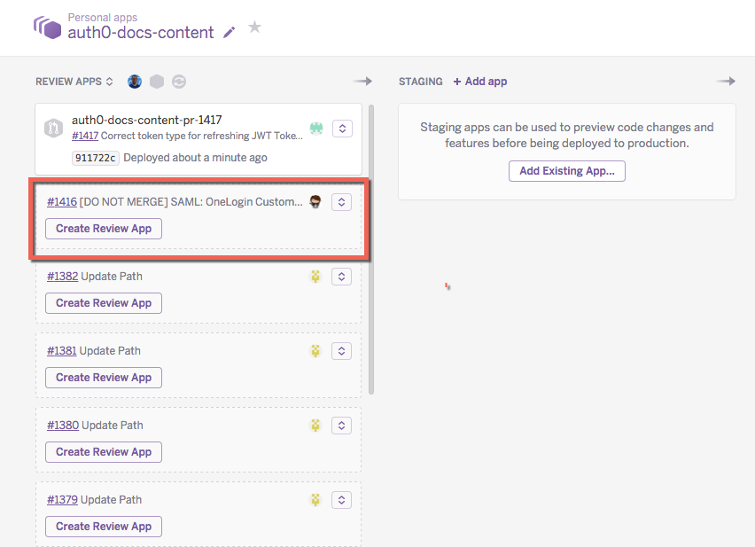
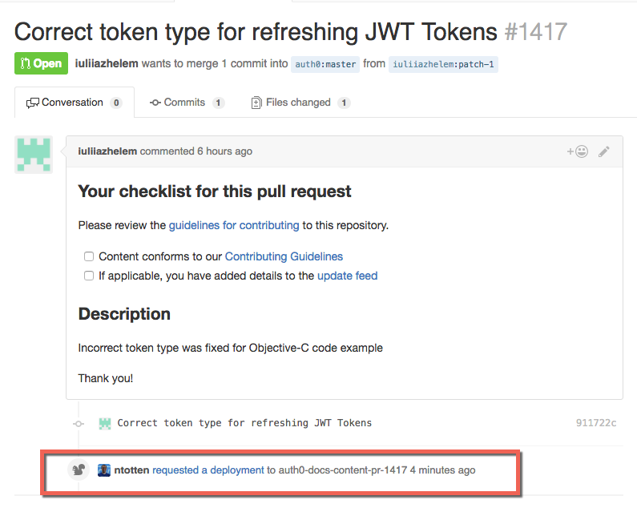
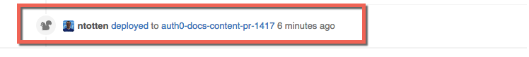

# Auth0 Documentation
This is the repository for the Auth0 documentation.

## Contribution Guidelines
* Read and follow the [Style Guide](STYLEGUIDE.md).
* Consult the [Words](WORDS.md) document for Auth0 specific spellings and definitions.
* Always use relative URLs for internal `auth0.com/docs` links. For example, if the absolute path to the document is `https://auth0.com/docs/identityproviders`, use `/identityproviders`. These links will be correctly formatted in the build process.
* Do not hard code links to Auth0 sites like `docs.auth0.com` or `manage.auth0.com`. Instead, use [Parameter Aliases](#parameter-aliases), such as `${uiUrl}`.
* Name files with all lowercase using dashes (-) to separate words. If using a year in the file name, it should be in the format YYYY-MM-DD. For example, `this-is-my-file.md` or `this-is-a-title-2015-10-01.md`.
* Do not store images in external locations like Dropbox, CloudUp, or the Auth0 CDN. Link to images in this repo using a relative path ``. The image will be uploaded to the CDN and the link will be formatted during the build process.
* Keep images to no more than 750 pixels wide.
* Screenshots of the Auth0 dashboard including the browser window with dropshadow can be up to 900 pixels wide to maintain legibility.
* Run all images through [TinyPNG](https://tinypng.com/).

## Contributing

### Reusing content
To avoid duplication of content, you can create document fragments to be referenced from other documents. The process of including another document is shown below.

First, create your fragment document. The convention is to name fragments with an underscore, like: `_mydocument.md`.

After you create your markdown document, you can reference it in another document with a relative path:

```
<%= include('../_mydocument.md') %>
```

Additionally, you can send variables to the included document:

```
<%= include('../_mydocument.md', { key: 'value', something: true }) %>
```

### Markdown
Markdown on this site conforms to the [CommonMark](http://commonmark.org/) spec. Additionally, there are a few custom markdown features available as described below.

#### Warning banner
You can add a warning banner to the top of a page to notify that a page is deprecated or other similar messages.

```
::: warning-banner
You message here
:::
```

#### Panels
Panels can be useful to separate information from the main body of a document.

```
::: panel-primary This is a panel
Panel content
:::

::: panel-warning This is a warning
Panel content
:::

::: panel-info This is info
Panel content
:::

::: panel-danger This is a dangerous
Panel content
:::

::: panel-success This is good
Panel content
:::
```

#### HTTP Request Snippets
You can add a [HAR request format](http://www.softwareishard.com/blog/har-12-spec/#request) snippet to make an example HTTP request availible in a variety of languages. This will generate a tab view showing the HTTP request in various languages.

**NOTE:** You need to set the language type to `har` for this to work. View this raw markdown document for an example.


```har
{
    "method": "GET",
    "url": "http://www.example.com/path/?param=value",
    "httpVersion": "HTTP/1.1",
    "cookies": [],
    "headers": [
      { "name" "Authorization", "value": "Bearer ABCD" }
    ],
    "queryString" : [],
    "postData" : {},
    "headersSize" : 150,
    "bodySize" : 0,
    "comment" : ""
}
```

* method [string] - Request method (GET, POST, ...).
* url [string] - Absolute URL of the request (fragments are not included).
* httpVersion [string] - Request HTTP Version.
* cookies [array] - List of cookie objects.
* headers [array] - List of header objects.
* queryString [array] - List of query parameter objects.
* postData [object, optional] - Posted data info.
* headersSize [number] - Total number of bytes from the start of the HTTP request message until (and including) the double CRLF before the body. Set to -1 if the info is not available.
* bodySize [number] - Size of the request body (POST data payload) in bytes. Set to -1 if the info is not available.
* comment [string, optional] (new in 1.2) - A comment provided by the user or the application.


### Auth0 Screenshots
On Mac OS X screenshots of the Auth0 interface need to be taken with Chrome, taking into account the following:

 1. The browser cannot show any plugins, customizations, or bookmarks.
 1. The browser cannot be in incognito mode.
 1. The browser needs to be resized to the standard size. Using the below script:

  ```bash
  osascript -e 'tell application "Chrome" to set the bounds of the front window to {100, 150, 1200, 900}'
  ```
 1. Auth0 screenshots should capture the complete browser window (**Control + Shift + 4**, then press **Space**).
 1. Use color **#0099CC** for highlights.
 2. Resize image to a maximum 900px width.

 Example:

 

#### Close-ups
The exception to showing the full browser window is for highlighting a detail as part of a tutorial, for example, to show a field requiring input.

It is often best to shrink the screenshot slightly to avoid having the image of the UI be mistaken for the actual UI.

#### Borders
For close-ups and other screenshots that do not include the browser window, apply a 1px centered border (**select all > edit > stroke**) of color **#cccccc** to keep the image from blending with the background and appearing to float.


## Test Procedures
When testing a document or tutorial:

1. Ensure that the code in the tutorials is correct and functions as expected.
1. Ensure that the steps (1..n) are in an order that makes sense and that there are no missing or duplicate steps.
1. Check for broken links.
1. Check for outdated screenshots of the Auth0 dashboard or product and third-party sites.
1. Ensure that the code in the seed project download functions as expected.
1. Check for outdated dependencies, both Auth0 dependencies and third-party (i.e. node modules, nuget packages, gems, etc.).

## Review Apps
If you have access to the Auth0 Heroku account, you can create a preview release for your pull request:

1. Login to Heroku and open the `auth0-docs-content` pipeline.
2. Find the Review App for your pull request and click the **Create Review App** button.
  
3. Once the app begins deployment, you will see the status of your PR updating. The deployment takes about 5 minutes.
  
4. Once the deployment completes, you will see the status change. You can click the link in the PR to open the preview site.
  

## Quickstarts
All quickstart data comes directly from the docs API at `/meta/quickstart`. This means that the quickstart on docs and manage will both consume the same datasource and will always be up-to-date. To add a new quickstart, add the markdown document to the appropriate folder: [server-apis](/articles/server-apis), [server-platforms](/articles/server-platforms), [native-platforms](/articles/native-platforms), or [client-platforms](/articles/client-platforms). The only requirement is that you specify the correct front matter.

For all quickstart docs, provide the following:

```yaml
---
title: Document Title
name: Quickstart Name
image: //cdn.auth0.com/path/to/icon.png
thirdParty: true|false  # For server apis only
hybrid: true|false # For native platforms only
snippets:
  dependencies: folder/dependencies.html
  setup: folder/app.js
  use: folder/login.js
---
```

For each quickstart, you must specify the snippets and create the associated snippet file in the `/snippets` folder. You must provide all three snippets for each quickstart: `dependencies`, `setup`, and `use`. To include the snippet in the quickstart document simply reference it as follows:

```md
${snippet(meta.snippets.use)}
```

After you publish the doc update, the new quickstart will automatically appear on both docs and manage.

Additionally, the quickstart configuration is also in this repository: [quickstart.yml](/quickstart.yml).

## Updates Feed
Publishing content updates is easy. Just create a yml file in the `/updates` folder in the format `YYYY-MM-DD.yml`. The document should be in the following format. There are three sections of content: added, changed, and fixed. If you are releasing a new thing (such as a new tutorial, document, or new version of an SDK) put it under `added`. Otherwise use `changed` or `fixed`.

```
added:
  -
    title: "Name of new thing"
    tags:
      - tag1
      - tag2
    description: |
      The description can be as long as it needs, but keep it reasonable. If you need more you should probably write a separate document. Descriptions can contain markdown such as [link](https://auth0.com) or `code snippets`.
  -
    title: "Name of update"
    tags:
      - tag1
      - tag2
    description: |
      The description can be as long as it needs, but keep it reasonable. If you need more you should probably write a separate document. Descriptions can contain markdown such as [link](https://auth0.com) or `code snippets`.
changed:
  -
    title: "Name of thing that changed or was removed"
    tags:
      - tag1
      - tag2
    description: |
      The description can be as long as it needs, but keep it reasonable. If you need more you should probably write a separate document. Descriptions can contain markdown such as [link](https://auth0.com) or `code snippets`.
fixed:
  -
    title: "Name of bug fixed"
    tags:
      - tag1
      - tag2
    description: |
      The description can be as long as it needs, but keep it reasonable. If you need more you should probably write a separate document. Descriptions can contain markdown such as [link](https://auth0.com) or `code snippets`.
```

## API

> WARNING: This API is for Auth0 internal use only. You should not rely on the docs API for anything. There is *NO SLA or support* for the document API.

All document content is accessible through the docs API as well as through regular HTML.

To request a document in embedded format (i.e. no template html) to embed externally, append `?e=1` to any url.

To request a document in the framed format (i.e. no header, footer, or navigation) to use in a window popup or an iframe, append `?framed=1` to any url.

To request content in JSON or JSONP format, pass the header `Accept: 'application/json'` and optionally specify a ``?callback=foo` query parameter for JSONP.

You can also request the document metadata be included in the JSON or JSONP responses by appending `?m=1` to the query.

## Code snippets
Code snippets are available both through the API and for use in markdown.

Access via API:

GET: `/docs/meta/snippets/{hash}`
Response:
```json
{
  "title": "{title}",
  "content": "{<pre><code class="{class}">{code}</code></pre> }",
  "hash": "{hash}"
  "additional_metadata": ""
}
```

Use in markdown:

```md
${snippet('{hash}')}
```

## Connections
Connections are available both through the API and for use in markdown.

Access via API:

GET: `/docs/meta/connections`
GET: `/docs/meta/connections/{type}`
GET: `/docs/meta/connections/{type}/{connection}`
Response:
```json
{
  "title": "{title}",
  "hash": "{hash}",
  "url": "https://auth0.com/docs/path/to/doc",
  "image": "https://cdn.auth0.com/docs/path/to/image.png",
  "type": "database|social|enterprise",
  "alias": [
    "alias1"
  ]
}
```

## Documents metadata properties

- `sitemap`: (Boolean) Indicates if the document will be indexed into `sitemap.xml`. Defaults to `true`.
- `public`: (Boolean) Indicates if the document will be rendered through a public url or in the sitemap. The document will still be available from the API. Defaults to `true`.
- `description`: Every browsable document requires a description of up to 2 complete sentences. Please add a description to all new docs and any existing doc that you are working on.


## Parameter Aliases
When writing docs you can use the following variables instead of hard-coding these values. You can use `${variableName}` within any markdown document to reference the value.

### Common Variables

| Variable  | Description | Default Value |
| :---------------------------- | :----------------------------------------- | :-------------------------------------- |
| `uiURL`                       | The url to the management portal.          | `https://manage.auth0.com`              |
| `auth0js_url`                 | The url to the auth0.js CDN location.      | |
| `auth0js_url_no_scheme`       | The url to the auth0.js CDN location without the 'https:'. | |
| `auth0_angular_url`           | The url to the auth0 angular script CDN location. | |
| `auth0_angular_url_no_scheme` |  The url to the auth0 angular script in the CDN location without the 'https://'. | |
| `widget_url`                  | The url to the Lock script CDN location.   | |
| `widget_url_no_scheme`        | The url to the Lock script CDN location without the 'https:'. | |
| `lock_passwordless_url`       | The url to the Passwordless Lock script CDN location. | |


### User Specific Variables

| Variable  | Description | Default Value |
| :--------------------- | :------------------------------------------------- | :------------------------------------- |
| `account.appName`      | The name of the current Auth0 app.                 | `YOUR_APP_NAME`                        |
| `account.tenant`       | The name of the current Auth0 tenant.              | `YOUR_TENANT`                          |
| `account.namespace`    | The name of the current Auth0 namespace.           | `YOUR_NAMESPACE`                       |
| `account.clientId`     | The Client ID of the current Auth0 app.            | `YOUR_CLIENT_ID`                       |
| `account.clientSecret` | The Client Secret of the current Auth0 app.        | `YOUR_CLIENT_SECRET`                   |
| `account.callback`     | The first callback URL of the current Auth0 app.   | `http://YOUR_APP.auth0.com/callback`   |

## Issue Reporting

If you found a bug or have a feature request, please report it in this repository's [issues](https://github.com/auth0/docs/issues) section. Please do not report security vulnerabilities on the public GitHub issue tracker. The [Responsible Disclosure Program](https://auth0.com/whitehat) details the procedure for disclosing security issues.

## Author

[Auth0](auth0.com)

## License

This project is licensed under the MIT license. See the [LICENSE](LICENSE) file for more info.
