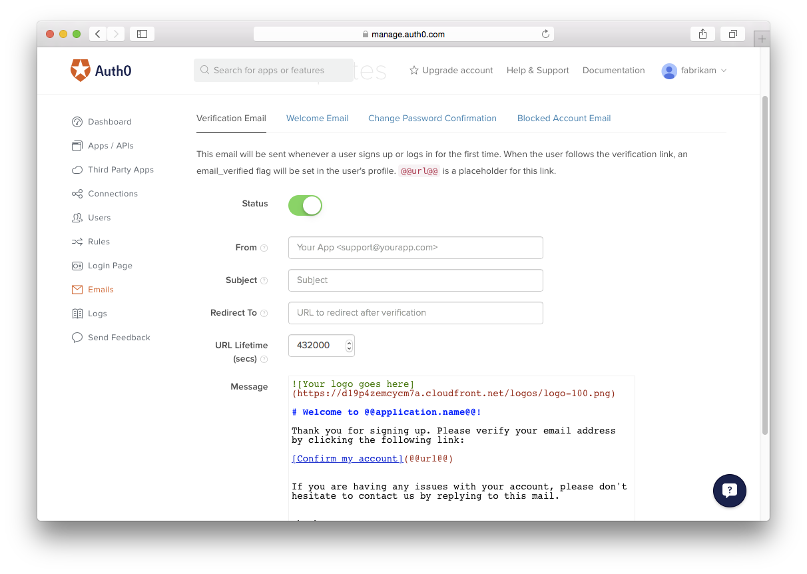

# Emails in Auth0

Auth0 can send emails to users when they sign up, when their email address needs to be validated and when they change their password.

The dashboard allows customizing these emails using Markdown templates and marcos which include the context of the current application and the current user.



## Configuring From, Subject and Redirect To

For each email type the **From address**, the **Subject**, the **URL Lifetime** and the **Redirect To** URL can be customized.

### From Address

The **From address** is the address the end user will see when receiving an email from Auth0. If you leave this field empty the **From address** will be set to the email address of the Auth0 account owner (in case there are multiple account users the system will use the email address of the first owner).

This field supports the following macros:

- `{application.name}`
- `{connection.name}`

With this macros you could set the display name of the **From address** to something specific for the current application the user signed up for. Eg: `{application.name} <support@fabrikamcorp.com>`

In order to avoid your emails ending up in the user's junk folder we recommend adding the required [SPF](http://en.wikipedia.org/wiki/Sender_Policy_Framework) and [DKIM](http://en.wikipedia.org/wiki/DKIM) DNS records, allowing Auth0 to send the emails on your behalf and digitally sign the messages.

Additionally, when SPF and DKIM are not configured you users might see the **From address** with "on behalf of" depending on the email client they're using:

> MyApp support@mail128-21.atl41.mandrillapp.com on behalf of MyApp support@fabrikamcorp.com

#### SPF Configuration

The SPF is configured by adding a TXT record to your domain. The hostname should be set to @ (or empty, depending on the provider). If this is the first time you're setting up an SPF record you'll need to declare it as follows:

```
v=spf1 include:spf.auth0.com ~all
```

If you're already sending emails from this domain and you want to add Auth0 to the SPF configuration just add it after your existing definitions. Eg:

```
v=spf1 include:outlook.com include:spf.auth0.com ~all
```

#### DKIM Configuration

The DKIM configuration is also added using a TXT record to the domain which you're sending from. The host name for this record should be set to `mandrill._domainkey` and the value set to:

```
v=DKIM1; k=rsa; p=MIGfMA0GCSqGSIb3DQEBAQUAA4GNADCBiQKBgQCrLHiExVd55zd/IQ/J/mRwSRMAocV/hMB3jXwaHH36d9NaVynQFYV8NaWi69c1veUtRzGt7yAioXqLj7Z4TeEUoOLgrKsn8YnckGs9i3B3tVFB+Ch/4mPhXWiNfNdynHWBcPcbJ8kjEQ2U8y78dHZj1YeRXXVvWob2OaKynO8/lQIDAQAB;
```

### Subject

The **Subject** supports the following macros:

- `{application.name}`
- `{connection.name}`
- `{user.email}`

If this value is empty the subject will be set depending on the type of email which is being sent. Eg: **Verify your email**

### Redirect To

The **Redirect To** field allows you to control to which URL users will be redirected after clicking the link in one of the emails. 

- `{application.callback_domain}`
- `{application.name}`

You would then be able to redirect users to a page on the Allowed Callback URL, eg: `{application.callback_domain}/result_page`. Note that if the application has multiple Allowed Callback URLs configured the first one will be used.

### URL Lifetime

The **Verification Email** and **Change Password Confirmation Email** both contain a link which will allow the users to verify their email address or confirm the password change they made.

For security reasons the lifetime of this link can be changed. The default value is 432000 seconds (5 days).

When users click the expired link and a **Redirect To** URL is configured, they'll be redirected to this URL and the following information will be added to the querystring:

```
http://myapplication.com/my_page/?email=john%contoso.com&message=Access%20expired&success=false
```

## Email Templates

### Verification Email

This email will be sent whenever a user signs up or logs in for the first time. When the user follows the verification link, the `email_verified` property will be changed to `true` in the user's profile.

The following macros are available in this template:

- `{application.name}`
- `{connection.name}`
- `{user.email}`

When a **Redirect To** URL is configured the user will be redirected to this URL after the email address has ben verified and the following information will be added to the querystring:

```
http://myapplication.com/my_page/?email=john%40contoso.com&message=Your%20email%20was%20verified.%20You%20can%20continue%20using%20the%20application.&success=true
```

### Welcome Email

This email will be sent once the user verifies his or her email address. If the **Verification Email** is turned off, it will be sent when the user signs up or logs in for the first time.

The following macros are available in this template:

- `{application.name}`
- `{connection.name}`
- `{user.email}`

### Change Password Confirmation Email

This email will be sent whenever a user changes passwords. The password will not be changed until the user follows the verification link in the email.

The following macros are available in this template:

- `{application.name}`
- `{connection.name}`
- `{user.email}`

When a **Redirect To** URL is configured the user will be redirected to this URL after the email address has ben verified and the following information will be added to the querystring:

```
http://myapplication.com/my_page/?success=true&message=You%20can%20now%20login%20to%20the%20application%20with%20the%20new%20password.
```

### Blocked Account Email

This email will be sent whenever a user account is blocked. Each time a login fails for a user coming from a specific IP address the failed login count increases. When the count reaches 10 the user won't be able to login again from that IP address until the link in the Blocked Account Email is clicked.

If the user logs in before the counter reaches 10, the failed login counter will be reset to 0.

The following macros are available in this template:

- `user.source_ip`
- `user.city`
- `user.country`
- `application.name`
- `connection.name`

## Advanced Topics

- [Using your own SMTP provider (SendGrid/Amazon SES/Mandrill)](@@env.BASE_URL@@/email/providers)
- [Take control of the complete email flow](@@env.BASE_URL@@/email/custom)