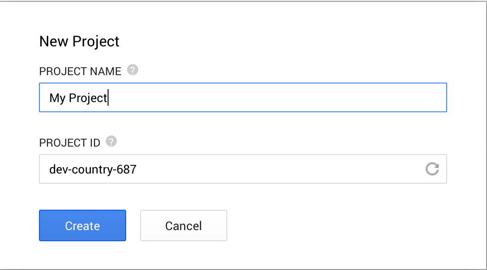
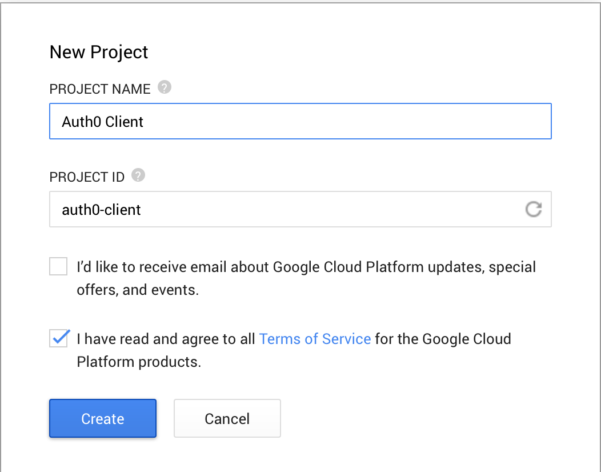
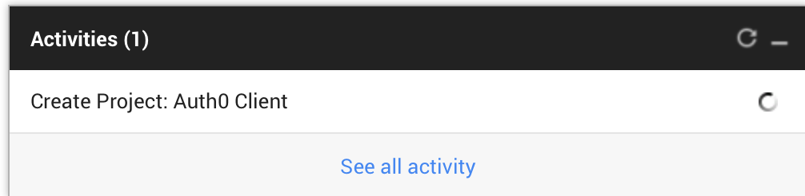
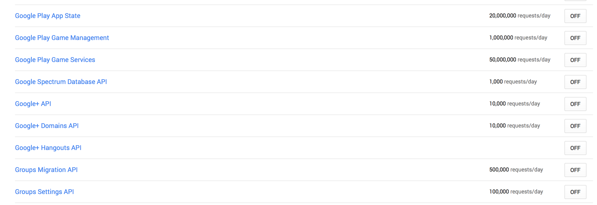
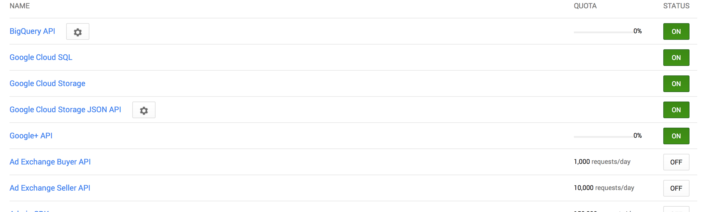
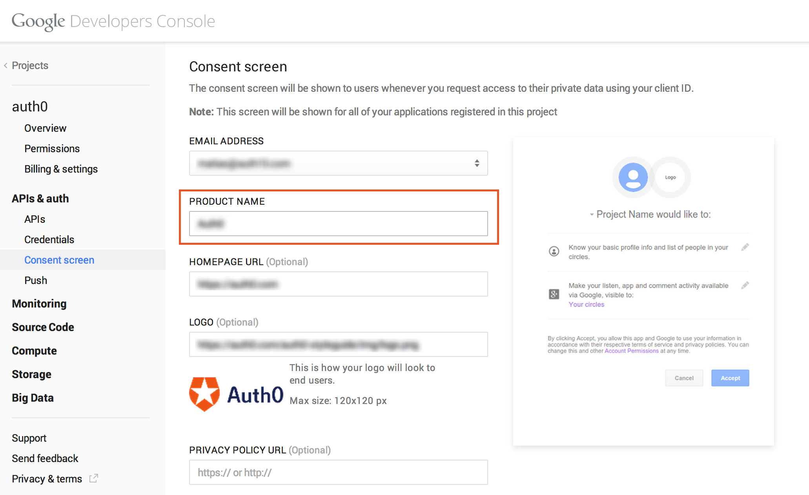
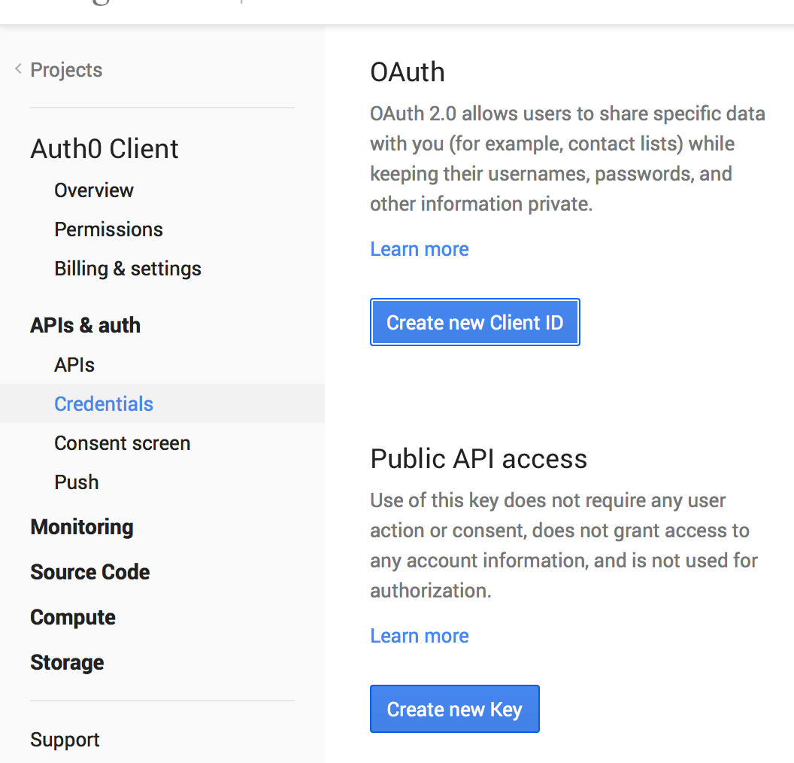
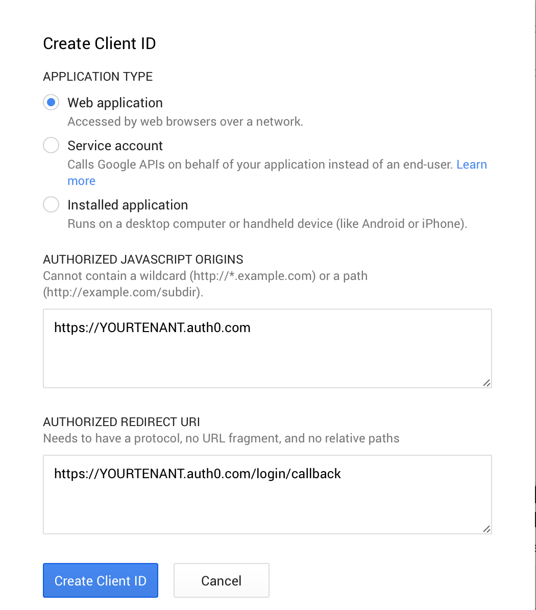
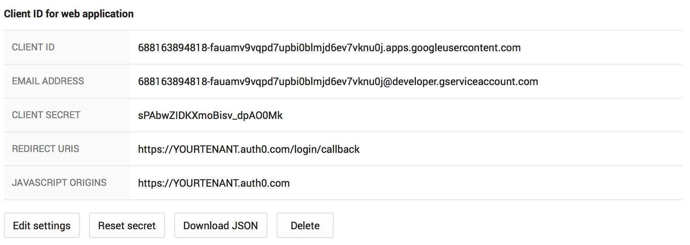
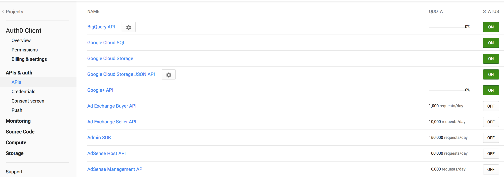

# Obtaining a ClientId and Client Secret for Google

To configure Google OAuth connections (Google Apps and Google) you will need to register Auth0 with Google on the API Console.

##1. Log in  API Console
Go to the [API Console](https://console.developers.google.com), and click __Create Project__.

A dialog like the one shown in the following figure will be displayed.

##2. Complete information about your instance of Auth0

Provide your app's information and click **Create**.

> The information provided in this dialog is not related to Auth0. It is only useful for your reference

An activity will begin, as shown in the following figure. Once the activity is completed you will be redirected to the project's dashboard to continue with the next steps.

---

##3. Enable the Google+ API

Click **Enable an API** and locate the **Google+ API** item in the list.

Enable it by clicking **OFF**.

---

##4. Set up Consent Screen

Under APIs & auth, go to **Consent Screen**. Here, enter your **Product Name** that will be shown when users try to log in through Google:

If this field is not present, your users may see errors such as `invalid_client: no application name` when attempting to log in.

##5. Get your ClientId and ClientSecret

Click **Credentials** in the left sidebar and then click **Create new Client ID**.

Enter your account's information. That means replacing the appearances of **"YOURTENANT"** in the following figures with your Auth0 account name.

When prompted, use the following settings:

* Authorized JavaScript Origins: `https://@@account.namespace@@`
* Authorized Redirect URI: `https://@@account.namespace@@/login/callback`

Click **Create Client ID**. The resulting settings will be displayed:

You can now use the client ID and secret for your Auth0 connection's settings.

##6. Enable Admin SDK Service

If you are planning to connect Google Apps enterprise domains, you need to enable the __Admin SDK__ service.

To do so, click **API** in the left sidebar, locate the **Admin SDK** item and click **OFF** to turn it on.

