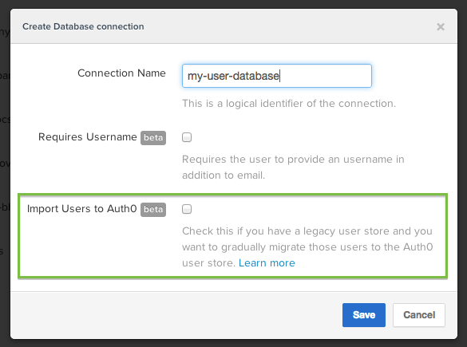

# Importing users to Auth0

Our focus has always been not only greenfield projects but also existing applications that want to extend their Authentication capabilities.

We have released a new feature that enables the gradual migration of users from an existing **Database Connection** to Auth0.

## How to enable it?

Check the "Import Users to Auth0" option in the connection settings:



## How does it work?

When you write a **login script** in the database connection to authenticate users, for instance:

```javascript
function (email, password, callback) {

  // validate user/password against your existing database
  request.get({
    url:  'https://myapp.com/existingdatabase/login',
    auth: {
      username: email,
      password: password
    }
  }, function (err, response, body) {
    if (err) return callback(err);
    if (response.statusCode === 401) return callback();
    var user = JSON.parse(body);

    // return the user information that you
    // want to persist into Auth0 as a new user
    callback(null,   {
      user_id:     user.user_id.toString(),
      nickname:    user.nickname,
      email:       user.email
    });
  });
}
```

Then when a user authenticates, the following process takes place:


So for example, let's say you have a MySQL database and you are hashing passwords with SHA1. You would define the script that connects to MySQL, gets the user from the DB and then uses `crypto.createHash('sha1')` to hash the password and check against the stored password. If that was succesful, the user will be automatically created in Auth0 database and his/her password will be hashed using `bcrypt` with 12 iterations (our default hashing algorithm). Next time a user logs in, we will check against OUR database and our hash.

> Note: Password resets will only affect the users stored in Auth0, and new users will be stored in Auth0 only.
