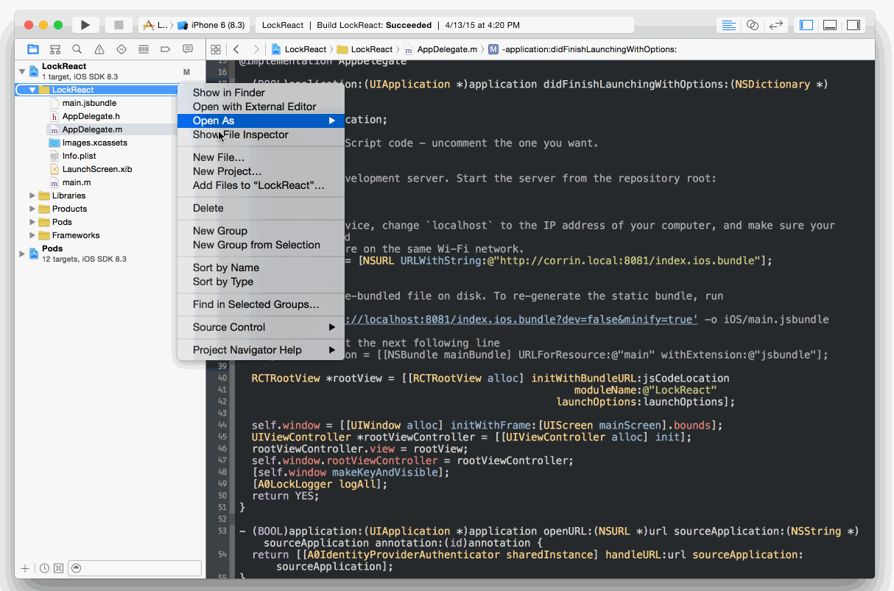

## iOS React Native Tutorial

<% if (configuration.api && configuration.thirdParty) { %>

<div class="package" style="text-align: center;">
  <blockquote>
    <a href="@@base_url@@/native-mobile-samples/master/create-package?path=iOS/basic-sample-reactnative&type=replace&filePath=iOS/basic-sample-reactnative/iOS/Info.plist@@account.clientParam@@" class="btn btn-lg btn-success btn-package" style="text-transform: uppercase; color: white">
      <span style="display: block">Download a Seed project</span>
      <% if (account.userName) { %>
      <span class="smaller" style="display:block; font-size: 11px">with your Auth0 API Keys already set and configured</span>
      <% } %>
    </a>
  </blockquote>
</div>

<% } else  { %>

<div class="package" style="text-align: center;">
  <blockquote>
    <a href="@@base_url@@/native-mobile-samples/master/create-package?path=iOS/basic-sample-reactnative&type=replace&filePath=iOS/basic-sample-reactnative/iOS/Info.plist@@account.clientParam@@" class="btn btn-lg btn-success btn-package" style="text-transform: uppercase; color: white">
      <span style="display: block">Download a Seed project</span>
      <% if (account.userName) { %>
      <span class="smaller" style="display:block; font-size: 11px">with your Auth0 API Keys already set and configured</span>
      <% } %>
    </a>
  </blockquote>
</div>

<% } %>

**Otherwise, if you already have an existing React Native application, please follow the steps below.**

### Before Starting

<div class="setup-callback">
<p>Go to the <a href="@@uiAppSettingsURL@@" target="_new">Application Settings</a> section in the Auth0 dashboard and make sure that <b>Allowed Callback URLs</b> contains the following value:</p>

<pre><code>a0@@account.clientId@@://*.auth0.com/authorize</pre></code>
</div>

### 1. Adding the Auth0 dependencies

Inside your project create a file named `Podfile` with these contents:

```ruby
pod 'LockReact', '~> 0.2'
```

and run `pod install`

> If you need help installing CocoaPods, please check this [guide](http://guides.cocoapods.org/using/getting-started.html)

### 2. Configuring Auth0 Credentials & Callbacks

Add the following entries to your app's `Info.plist`:

<table class="table">
  <thead>
    <tr>
      <th>Key</th>
      <th>Value</th>
    </tr>
  </thead>
  <tr>
    <td>Auth0ClientId</td>
    <td>@@account.clientId@@</td>
  </tr>
  <tr>
    <td>Auth0Domain</td>
    <td>@@account.namespace@@</td>
  </tr>
</table>

Also you'll need to register a new _URL Type_ with the following scheme
`a0@@account.clientId@@`. You can do it from your app's target Info section.


### 3. Register Native Authentication Handlers

To allow native logins using other iOS apps, e.g: Twitter, Facebook, Safari etc, you need to add the following method to your `AppDelegate.m` file.

```objc
#import <Lock/Lock.h>

- (BOOL)application:(UIApplication *)application openURL:(NSURL *)url sourceApplication:(NSString *)sourceApplication annotation:(id)annotation {
    return [[A0IdentityProviderAuthenticator sharedInstance] handleURL:url sourceApplication:sourceApplication];
}
```

> If you need Facebook or Twitter native authentication please continue reading to learn how to configure them. Otherwise please go directly to the __step #4__

#### Facebook

Lock uses the native Facebook SDK to obtain the user's access token so you'll need to configure it using your Facebook App info:

First, add the following entries to the `Info.plist`:

<table class="table">
  <thead>
    <tr>
      <th>Key</th>
      <th>Value</th>
    </tr>
  </thead>
  <tr>
    <td>FacebookAppId</td>
    <td>YOUR_FACEBOOK_APP_ID</td>
  </tr>
  <tr>
    <td>FacebookDisplayName</td>
    <td>YOUR_FACEBOOK_DISPLAY_NAME</td>
  </tr>
</table>

Then, register a custom URL Type with the format `fb<FacebookAppId>`.

> For more information on how to configure this, please check [Facebook Getting Started Guide](https://developers.facebook.com/docs/ios/getting-started).

> **Note:** The Facebook app should be the same as the one set in Facebook's Connection settings on your Auth0 account

Here's an example of how the entries should look like:


Finally, you need to register Auth0 Facebook authenticator somewhere in your application. You can do that in the `AppDelegate.m` file, for example:

```objc
#import <Lock/Lock.h>

- (BOOL)application:(UIApplication *)application didFinishLaunchingWithOptions:(NSDictionary *)launchOptions {
    A0FacebookAuthenticator *facebook = [A0FacebookAuthenticator newAuthenticationWithDefaultPermissions];
    [[A0IdentityProviderAuthenticator sharedInstance] registerSocialAuthenticatorProvider:facebook];
}
```

####Twitter

To support Twitter native authentication you need to configure Auth0 Twitter authenticator:

```objc
#import <Lock/Lock.h>

- (BOOL)application:(UIApplication *)application didFinishLaunchingWithOptions:(NSDictionary *)launchOptions {
  NSString *twitterApiKey = ... //Remember to obfuscate your api key
  NSString *twitterApiSecret = ... //Remember to obfuscate your api secret
  A0TwitterAuthenticator *twitter = [A0TwitterAuthenticator newAuthenticationWithKey:twitterApiKey                                                                            andSecret:twitterApiSecret];
  [[A0IdentityProviderAuthenticator sharedInstance] registerSocialAuthenticatorProvider:twitter];
}
```

### 4. Add Native Module for Lock to your project

Create an Objective-C class (LockReactModule in this case) that will allow your JS code to call Lock. 

[](https://auth0.com)

`LockReactModule.h`

```objc
// LockReactModule.h file
#import <Foundation/Foundation.h>
#import "RCTBridgeModule.h"

@interface LockReactModule : NSObject<RCTBridgeModule>

@end
```

`LockReactModule.m`

```objc
#import "LockReactModule.h"
#import <LockReact/A0LockReact.h>

@implementation LockReactModule

RCT_EXPORT_MODULE();

RCT_EXPORT_METHOD(show:(NSDictionary *)options callback:(RCTResponseSenderBlock)callback) {
  dispatch_async(dispatch_get_main_queue(), ^{
    A0LockReact *lock = [[A0LockReact alloc] init];
    [lock showWithOptions:options callback:callback];
  });
}

RCT_EXPORT_METHOD(showSMS:(NSDictionary *)options callback:(RCTResponseSenderBlock)callback) {
  dispatch_async(dispatch_get_main_queue(), ^{
    A0LockReact *lock = [[A0LockReact alloc] init];
    [lock showSMSWithOptions:options callback:callback];
  });
}

RCT_EXPORT_METHOD(showTouchID:(NSDictionary *)options callback:(RCTResponseSenderBlock)callback) {
  dispatch_async(dispatch_get_main_queue(), ^{
    A0LockReact *lock = [[A0LockReact alloc] init];
    [lock showTouchIDWithOptions:options callback:callback];
  });
}

@end
```

> You can also download [LockReactModule.h](https://raw.githubusercontent.com/auth0/native-mobile-samples/master/iOS/basic-sample-reactnative/iOS/Modules/LockReactModule.h) and [LockReactModule.m](https://raw.githubusercontent.com/auth0/native-mobile-samples/master/iOS/basic-sample-reactnative/iOS/Modules/LockReactModule.m) and add them to your Xcode project.

### 5. Let's implement the login

Now we're ready to implement the Login. First we need to require the native module we've just created:

```js
var Lock = require('NativeModules').LockReactModule;
```

Then we can show _Lock_:

```js
Lock.show({}, (err, profile, token) => {
  if (err) {
    console.log(err);
    return;
  }
  // Authentication worked!
  console.log('Logged in with Auth0!');
});
```

[](https://auth0.com)

> **Note**: There are multiple ways of implementing the login box. What you see above is the Login Widget, but you can try our passwordless Login Widgets: [SMS](https://github.com/auth0/Lock.ReactNative#sms) or [TouchID](https://github.com/auth0/Lock.ReactNative#touchid)

On successful authentication, the callback function will yield the user's profile and tokens inside the parameters `profile` and `token` respectively.

### 5. Showing user information

After the user has logged in, we can use the `profile` object which has all the user information (Let's assume the profile is stored in a component's state object):

```js
  <Text>Welcome {this.state.profile.name}</Text>
  <Text>Your email is: {this.state.profile.email}</Text>
```

> You can [click here](@@base_url@@/user-profile) to find out all of the available properties from the user's profile. Please note that some of this depend on the social provider being used.

### 6. We're done

You've implemented Authentication with Auth0 in iOS & React Native. You're awesome!

