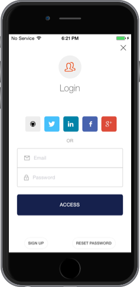

## iOS Swift Tutorial

<% if (configuration.api && configuration.thirdParty) { %>

<div class="package" style="text-align: center;">
  <blockquote>
    <a href="@@base_url@@/native-mobile-samples/master/create-package?path=iOS/basic-sample-swift&type=replace&filePath=iOS/basic-sample-swift/SwiftSample/Info.plist@@account.clientParam@@" class="btn btn-lg btn-success btn-package" style="text-transform: uppercase; color: white">
      <span style="display: block">Download a Seed project</span>
      <% if (account.userName) { %>
      <span class="smaller" style="display:block; font-size: 11px">with your Auth0 API Keys already set and configured</span>
      <% } %>
    </a>
  </blockquote>
</div>
<% } else  { %>

<div class="package" style="text-align: center;">
  <blockquote>
    <a href="@@base_url@@/native-mobile-samples/master/create-package?path=iOS/basic-sample-swift&type=replace&filePath=iOS/basic-sample-swift/SwiftSample/Info.plist@@account.clientParam@@" class="btn btn-lg btn-success btn-package" style="text-transform: uppercase; color: white">
      <span style="display: block">Download a Seed project</span>
      <% if (account.userName) { %>
      <span class="smaller" style="display:block; font-size: 11px">with your Auth0 API Keys already set and configured</span>
      <% } %>
    </a>
  </blockquote>
</div>


<% } %>

**Otherwise, if you already have an existing application, please follow the steps below.**
### Before Starting

<div class="setup-callback">
<p>Go to the <a href="@@uiAppSettingsURL@@" target="_new">Application Settings</a> section in the Auth0 dashboard and make sure that <b>Allowed Callback URLs</b> contains the following value:</p>

<pre><code>a0@@account.clientId@@://*.auth0.com/authorize</pre></code>
</div>

### 1. Adding the Auth0 dependencies

Add the following to the `Podfile` and run `pod install`:

```ruby
pod 'Lock', '~> 1.12'
pod 'JWTDecode', '~> 0.2'
```

> If you need help installing CocoaPods, please check this [guide](http://guides.cocoapods.org/using/getting-started.html)

### 2. Configuring your Swift project to use an ObjC library

Since [CocoaPods 0.36](http://blog.cocoapods.org/CocoaPods-0.36/) you can build any library as a Cocoa Touch framework. This allows to import them directly in your swift files like this:

```swift
import Lock
```

To enable this feature, just add this line at the top level of your `Podfile` (outside any target definition):

```ruby
use_frameworks!
```

> If you dont want to use this feature please read [this guide](https://github.com/auth0/Lock.iOS-OSX/wiki/Lock-&-Swift).

### 3. Configure Auth0 Lock for iOS

Add the following entries to your app's `Info.plist`:

<table class="table">
  <thead>
    <tr>
      <th>Key</th>
      <th>Value</th>
    </tr>
  </thead>
  <tr>
    <td>Auth0ClientId</td>
    <td>@@account.clientId@@</td>
  </tr>
  <tr>
    <td>Auth0Domain</td>
    <td>@@account.namespace@@</td>
  </tr>
</table>

Also you'll need to register a new _URL Type_ with the following scheme
`a0@@account.clientId@@`. You can do it from your app's target Info section.


The next step is to create and configure an instance of `A0Lock` with your Auth0 credentials from `Info.plist`. We are going to do this in a custom object called `MyApplication`.

```swift
import UIKit
import Lock

class MyApplication: NSObject {
    static let sharedInstance = MyApplication()
    let lock: A0Lock
    private override init() {
        lock = A0Lock()
    }
}
```

> You can create `A0Lock` in any other class, even in your AppDelegate, the only requirement is that you keep it in a **strong** reference.

### 4. Register Native Authentication Handlers

First in your AppDelegate method `application:didFinishLaunchingWithOptions:` add the following lines:

```swift
let lock = MyApplication.sharedInstance.lock
lock.applicationLaunchedWithOptions(launchOptions)
```

Then to allow native logins using other iOS apps, e.g: Twitter, Facebook, Safari etc, you need to add the following method:

```swift
func application(application: UIApplication, openURL url: NSURL, sourceApplication: String?, annotation: AnyObject?) -> Bool {
    let lock = MyApplication.sharedInstance.lock
    return lock.handleURL(url, sourceApplication: sourceApplication)
}
```

> If you need Facebook or Twitter native authentication please continue reading to learn how to configure them. Otherwise please go directly to __step #4__

**IMPORTANT**: Before you continue to the next section, please check that you have enabled and correctly configured the social connection with your own credentials in the [Dashboard](https://manage.auth0.com/#/connections/social)

#### Facebook

Lock uses the native Facebook SDK to obtain the user's access token so you'll need to configure it using your Facebook App info:

First, add the following entries to the `Info.plist`:

<table class="table">
  <thead>
    <tr>
      <th>Key</th>
      <th>Value</th>
    </tr>
  </thead>
  <tr>
    <td>FacebookAppId</td>
    <td>YOUR_FACEBOOK_APP_ID</td>
  </tr>
  <tr>
    <td>FacebookDisplayName</td>
    <td>YOUR_FACEBOOK_DISPLAY_NAME</td>
  </tr>
</table>

Then, register a custom URL Type with the format `fb<FacebookAppId>`.

> For more information on how to configure this, please check [Facebook Getting Started Guide](https://developers.facebook.com/docs/ios/getting-started).

> **Note:** The Facebook app should be the same as the one set in Facebook's Connection settings on your Auth0 account

Here's an example of how the entries should look like:


Then add Lock Facebook's Pod

```ruby
pod 'Lock-Facebook', '~> 2.0'
```

After that, where you initialize `A0Lock`, import `LockFacebook` module 

```swift
import LockFacebook
```

And register it with `A0Lock`:

```swift
let facebook = A0FacebookAuthenticator.newAuthenticatorWithDefaultPermissions()
lock.registerAuthenticators([facebook])
```

####Twitter

First add Lock Twitter's Pod

```ruby
pod 'Lock-Twitter', '~> 1.0'
```

After that, where you initialize `A0Lock`, import `LockTwitter` module 

```swift
import LockTwitter
```

And register it with `A0Lock`:

```swift
let apiKey = ... //Remember to obfuscate your api key
let apiSecret = ... //Remember to obfuscate your api secret
let twitter = A0TwitterAuthenticator.newAuthenticationWithKey(apiKey, andSecret:apiSecret)
lock.registerAuthenticators([twitter])
}
```

### 5. Let's implement the login
Now we're ready to implement the Login. We can instantiate `A0LockController` and present it as a modal screen. In one of your controllers instantiate the native widget and present it as a modal screen:

```swift
let lock = MyApplication.sharedInstance.lock
let controller = lock.newLockViewController()
controller.closable = true
controller.onAuthenticationBlock = {(profile:A0UserProfile!, token:A0Token!) -> () in
  // Do something with token & profile. e.g.: save them.
  // Lock will not save the Token and the profile for you.
  // And dismiss the ViewController
  self.dismissViewControllerAnimated(true, completion: nil)
}
self.presentViewController(controller, animated: true, completion: nil)
```

[](https://auth0.com)

> **Note**: There are multiple ways of implementing the login box. What you see above is the Login Widget, but if you want, you can use [your own UI](https://github.com/auth0/Lock.iOS-OSX/wiki/Getting-Started:-Use-your-own-UI). 
> Or you can also try our passwordless Login Widgets: [SMS](https://github.com/auth0/Lock.iOS-OSX#sms) or [TouchID](https://github.com/auth0/Lock.iOS-OSX#touchid)

On successful authentication, `onAuthenticationBlock` will yield the user's profile and tokens.

> To learn how to save and manage the tokens and profile, please read [this guide](https://github.com/auth0/Lock.iOS-OSX/wiki/How-to-save-and-refresh-JWT-token)

### 7. Showing user information

After the user has logged in, we can use the `profile` object which has all the user information:

```swift
  self.usernameLabel.text = profile.name
  self.emailLabel.text = profile.email
```

> You can [click here](@@base_url@@/user-profile) to find out all of the available properties from the user's profile or you can check [A0UserProfile](https://github.com/auth0/Lock.iOS-OSX/blob/master/Pod/Classes/Core/A0UserProfile.h). Please note that some of this depend on the social provider being used.

### 8. We're done

You've implemented Login and Signup with Auth0 in iOS. You're awesome!
