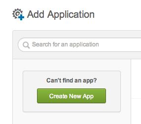
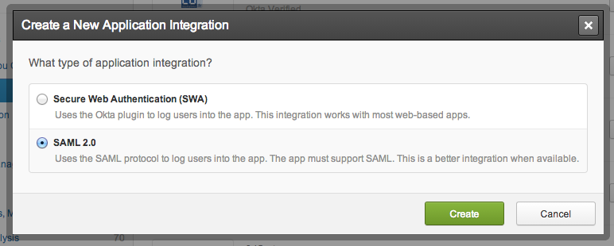
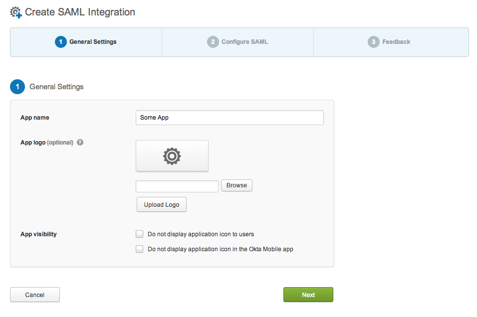
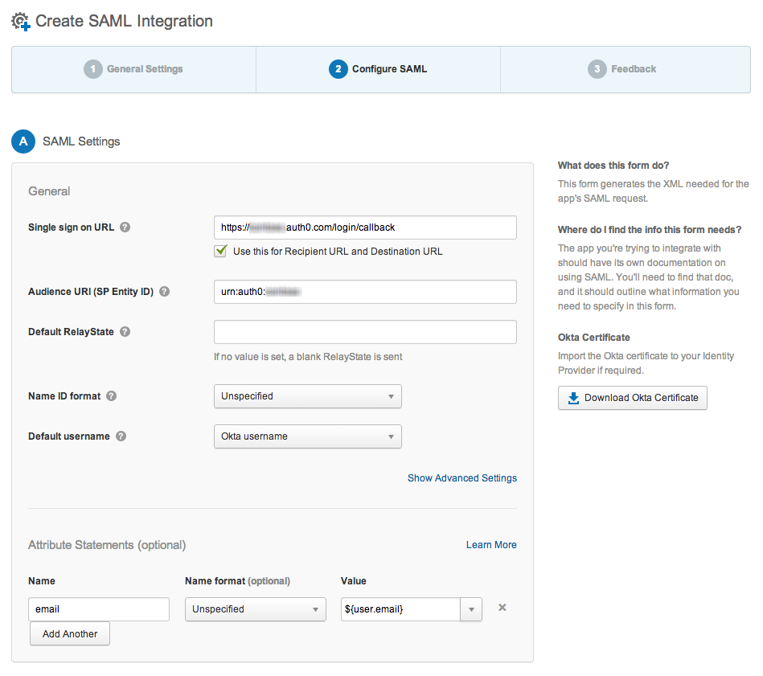
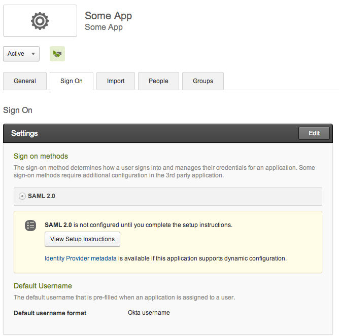
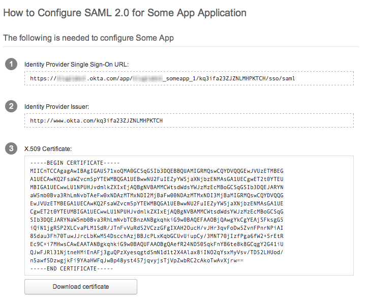
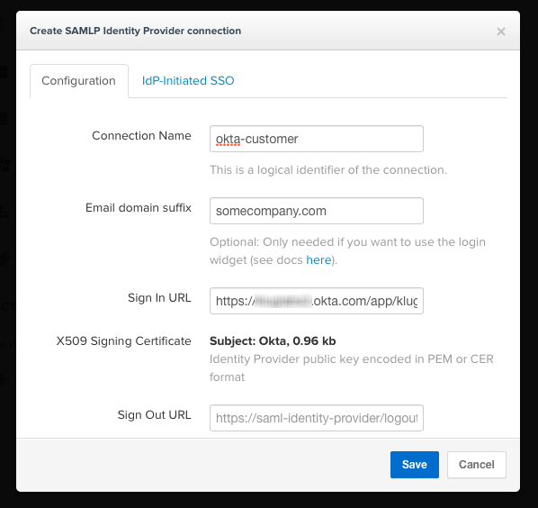
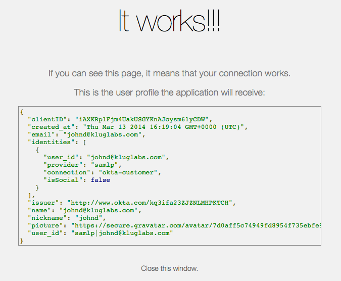

# Configuring Okta as an Identity Provider

# On Okta dashboard...

Go to Okta dashboard and click on **Applications**. Click on **Create New App**.

Select **SAML 2.0**.

Enter the name of your app and optionally a Logo and click **Next**.

Enter the following values:

* **Single sign on URL**: https://@@account.namespace@@/login/callback
* **Audience URI (SP Entity ID)**: urn:auth0:@@account.tenant@@:@@connectionName@@
* Add an Attribute Statement to map "email" to ${user.email}

Select this is an internal application and then Finish.

Click on **View Setup Instructions**

Take note of the following:

* **Identity Provider Single Sign-On URL**
* **Download certificate**

# On Auth0 dashboard...

Go to **Connections** -> **Enterprise** -> **SAMLP Identity Provider** and click **+NEW**

* Give it a name identifier (e.g. okta-customer) and copy the **Identity Provider Single Sign-On URL** that you've got from Okta on the **Sign In URL** input

* Upload the okta.cer certificate

Click on **Save** and close the next dialog. You will get asked which application you want to connect this to.

# Testing

If you have a user on Okta you can now click on **Try** on your Auth0 dashboard and you should be redirected to Okta:

> **Note**: the **Try** button only works for users logged in to Auth0 dashboard. You can't send this to an anonymous user (e.g. a customer). If you don't have a Okta user, read the following section to configure IdP Initiated SignOn so the customer can try on their portal.

## IdP Initiated SignOn

Okta has an Application Portal / Launcher for their users. If you want to support that, you will have to change the Single sign on URL in Okta dashboard to be:

* **Single sign on URL**: https://@@account.namespace@@/login/callback?connection=okta-customer

Where `okta-customer` is the connection name you assigned in Auth0 dashboard.

Also, you have to pick the application to redirect after the SAML assertion is consumed. You can find this in the **Connection -> IdP Initated SSO tab**.

## Troubleshooting

If a user is returned to the Okta dashboard after authenticating via Okta in a ServiceProvider-initiated login flow, check the following:

1. If your application is integrated with Auth0 using the OpenID Connect protocol, Auth0 will take the value of the 'state' parameter and pass it on to Okta in the SAML "RelayState" parameter. Therefore, make sure you are setting the 'state' parameter to a value that Okta can use.

2. In the Okta configuration screen titled "(2) Configure SAML", click on "Show Advanced Settings" and check the option for "Request Compression".  The Okta documentation indicates this should be checked if the value of this parameter is compressed.  Some Okta users have reported it should be checked for HTTP Redirect binding and uncompressed for HTTP POST binding.   