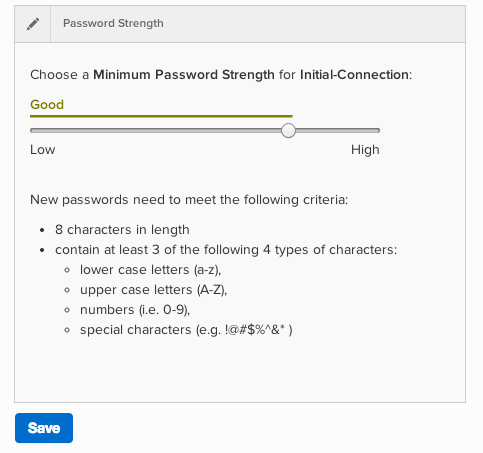
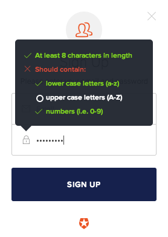
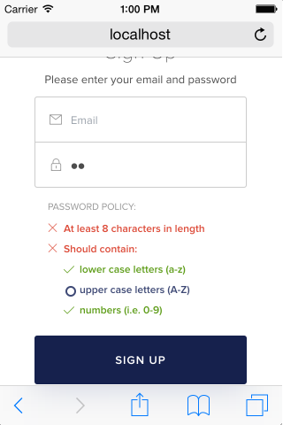

# Password Strength in Auth0 Database Connections

> Note: the __Password Strength__ feature is only available in database connections. The password complexity in Social and Enterpise connections is enforced by the providers.

## Policies

With this feature, Auth0 allows to customize the level of complexity of the passwords a user enters during sign-ups. Auth0 offers 5 levels of security matching the [OWASP password recommendations](https://www.owasp.org/index.php/Authentication_Cheat_Sheet#Implement_Proper_Password_Strength_Controls):

 * **None** (default): the password must exist and be at least 1 character in length.
 * **Low**: must be at least 6 characters in length.
 * **Fair**: at least 8 characters in length, it must contain a lower case letter, an upper case letter and a number.
 * **Good**: at least 8 characters in length. Contains at least 3 of the following 4 characters: a lower case letter, an upper case letter, a number or an special character  (e.g. !@#$%^&*)
 * **Excellent**: at least 10 characters in length. No more than 2 identical characters in a row (e.g., "aaa" is not allowed). Contains at least 3 of the following 4 types of characters: a lower case letter, an upper case letter, number and special characters (e.g. !@#$%^&*).


## Changing your policy

To change the password strength policy, go to [Database connections](https://app.auth0.com/#/connections/database), click on the `Security` button on the connection you want to apply it:



On subsequent user sign-ups or changes to their passwords, the policy will be enforced. If their entered password does not match the required criteria, the password will be rejected by Auth0 and they will be asked to pick another one that complies with the requirements.

Existing passwords entered prior to changing the policy will continue to operate.

### Lock

After enabling password policies, on signup and reset Lock modes user will be notified when their password does not meet the required criteria.

On desktop:



On mobile:



## Custom Signup Errors

Sign-up errors will return a 400 HTTP status code. The response JSON will contain a `code: invalid_password` when the password does not meet the password policy criteria.

The response also has additional information that can be used to guide the user intp what is wrong with the selected password:

* A `message` is ready to be formated using the `printf` function (or Node.js `util.format`).
* `format` is an array with values to be used in the `message`. (We separate the `message` from the `format` to allow easier i18n of this error messages in custom UIs.
* `verified` can be either `true` or `false` and signals if the rule has triggered or not. 

> Some rules are composites: a rule may contain an `items` field that specifies which sub-rules have failed. Each sub-rule will have a `message` and may have a `format` if required.

###Samples

This is the `description` reported with a `good` policy, and using the string `hello` as the password:

```json
  {
    "rules":[
      {"message":"At least %d characters in length","format":[8],"verified":false},
      {"message":"Contain at least %d of the following %d types of characters:","format":[3,4],
        "items":[
          {"message":"lower case letters (a-z)","verified":true},
          {"message":"upper case letters (A-Z)","verified":false},
          {"message":"numbers (i.e. 0-9)","verified":false},
          {"message":"special characters (e.g. !@#$%^&*)","verified":false}
        ],"verified":false}
      ],"
      verified":false
    }
```

This is the `description` error report using a `good` policy, and `hello1234` as the password:

```json
  {
    "rules":[
      {"message":"At least %d characters in length","format":[8],"verified":true},
      {"message":"Contain at least %d of the following %d types of characters:","format":[3,4],
        "items":[
          {"message":"lower case letters (a-z)","verified":true},
          {"message":"upper case letters (A-Z)","verified":false},
          {"message":"numbers (i.e. 0-9)","verified":true},
          {"message":"special characters (e.g. !@#$%^&*)","verified":false}
        ],"verified":false}
      ],"
      verified":false
    }
```
