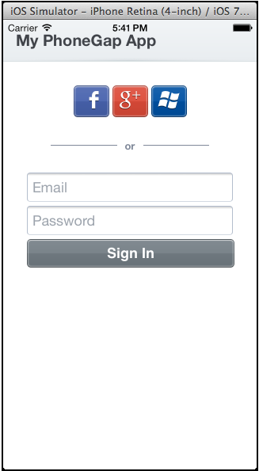

# Using Auth0 with PhoneGap (Cordova)

> **This tutorial is depracated. We've discontinued the Phonegap plugin. Please refer to [this new tutorial](@@base_url@@/new/native-platforms/cordova) to learn how to use Phonegap with Auth0**

This tutorial explains how to integrate Auth0 with a PhoneGap (Cordova) application. The __com.auth0.sdk__ plugin helps you authenticate users with any [Auth0 supported identity provider](identityproviders), via the OpenId Connect protocol (built on top of OAuth2).

## Tutorial

### 1. Install com.auth0.sdk plugin

1.1. Install the plugin executing the following at the command line:

```
phonegap local plugin add https://github.com/auth0/phonegap-auth0.git
```

1.2. Enable the plugin within your PhoneGap application by adding this line to the `www/config.xml` file:

```xml
<plugin name="Auth0Client" value="com.auth0.sdk" />
```

If you prefer using <a href="http://build.phonegap.com/" target="_new">PhoneGap Build</a>, you can ignore step #1.1 and include the following element to your `www/config.xml` file:

```xml
<gap:plugin name="com.auth0.sdk" />
```

1.3. In your html file, make sure to include a reference to the <a target="_new" href="http://jquery.com/download/">jQuery</a> library:

```html
<script type="text/javascript" src="js/jquery.min.js"></script>
```

1.4. Edit the `www/config.xml` file to include your Auth0 domain in the list of allowed origins:

```xml
<access origin="https://@@account.namespace@@" />
```

### 2. Setting up the callback URL in Auth0

<div class="setup-callback">
<p>Go to the <a href="@@uiAppSettingsURL@@" target="_new">Application Settings</a> section in the Auth0 dashboard and make sure that <strong>Allowed Callback URLs</strong> contains the following value:</p>

<pre><code>https://@@account.namespace@@/mobile</pre></code>
</div>

### 3. Integration
There are three options to do the integration:

1. Using the [Auth0 Login Widget](login-widget2) inside an InAppBrowser control (this is the simplest with only a few lines of code required).
2. Creating your own UI (more work, but higher control the UI and overall experience).
3. Using specific user name and password.

#### Option 1: Authentication using Login Widget

To start with, we'd recommend using the __Login Widget__. Here is a snippet of code to copy & paste on your project:

```javascript
var auth0 = new Auth0Client(
	"@@account.namespace@@",
	"@@account.clientId@@");

auth0.login(function (err, result) {
	if (err) return err;
	/*
	Use result to do wonderful things, e.g.:
		- get user email => result.profile.email
		- get facebook/google/twitter/etc access token => result.profile.identities[0].access_token
		- get Windows Azure AD groups => result.profile.groups
		- etc.
	*/
});
```



#### Option 2: Authentication with your own UI

If you know which identity provider you want to use, you can add a `connection` parameter and the user will be sent straight to the specified `connection`:

```javascript
auth0.login({ connection: "google-oauth2" }, function (err, result) {
	if (err) return err;
	/*
	Use result to do wonderful things, e.g.:
		- get user email => result.profile.email
		- get facebook/google/twitter/etc access token => result.profile.identities[0].access_token
		- get Windows Azure AD groups => result.profile.groups
		- etc.
	*/
});
```

> connection names can be found on Auth0 dashboard. E.g.: `facebook`, `linkedin`, `somegoogleapps.com`, `saml-protocol-connection`, etc.

#### Option 3: Authentication with specific user name and password

```javascript
auth0.login({
	connection: "sql-azure-database",
	username: 	"jdoe@foobar.com",
	password: 	"1234"
},
function (err, result) {
	if (err) return err;
	/* Use result to do wonderful things */
});
```

## Accessing user information

The `Auth0User` has the following properties:

* `profile`: returns a JSON object containing all available user attributes (e.g.: `user.profile.email`).
* `idToken`: is a Json Web Token (JWT) containing all of the user attributes and it is signed with your client secret. This is useful to call your APIs and flow the user identity.
* `auth0AccessToken`: the `access_token` that can be used to access Auth0's API. You would use this for example to [link user accounts](link-accounts).

## Download the sample

Browse the sample on GitHub from [here](https://github.com/auth0/phonegap-auth0-sample).


**Congratulations!**
