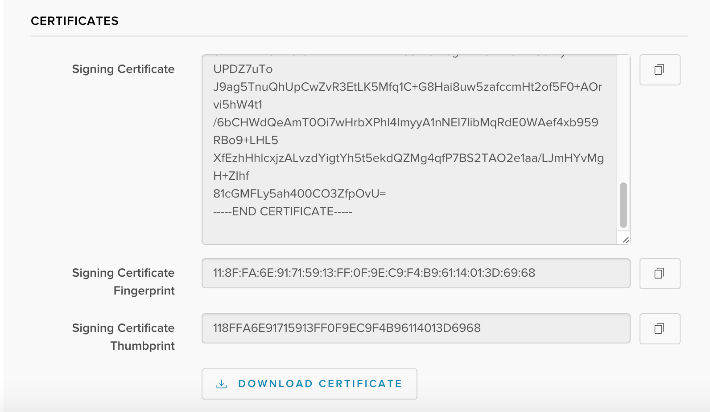
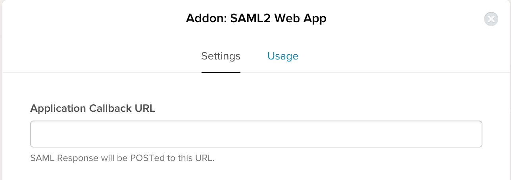
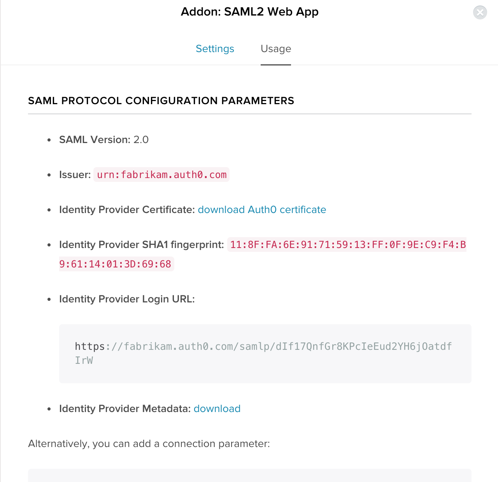

# Auth0 as Identity Provider

These instructions explain how to configure Auth0 to serve as an Identity Provider in a SAML federation.

There are **5 sections**, including a troubleshooting section at the end.

1. Obtain information from the Service Provider/Application
2. Configure Auth0 as IDP
3. Configure the Service Provider
4. Test 
5. Troubleshooting

##1. Obtain Information from the Service Provider

1. You will need to obtain from the Service Provider (application) the URL to which the SAML Authentication Assertion should be sent.  This may be called the Assertion Consumer Service URL, or the Post-back URL or the Callback URL.

##2. Configure Auth0 as IDP 

In this section you will configure Auth0 to serve as an Identity Provider.  You will do this by registering an application and using an AddOn.

**In the Auth0 dashboard:**

1. Click on **"Apps/APIs"** link at left.

2. Click on the red **"+ NEW APP/API"** button on the right.

3. In the **Name** field, enter a name like "MySAMLApp".

4. Press the blue **"SAVE"** button.

5. In the **Auth0 dashboard**, click again on the **"Apps/APIs"** link at left

6. Find the row for the application you just created, and click on the **"Settings"** icon to the right of the application name. (the round gear icon)

7. Scroll down and click on the **"Advanced Settings"** link.

8. In the expanded window, scroll down to the **"CERTIFICATES"** section and click on the **"DOWNLOAD CERTIFICATES"** button.  In the popup which appears, select "PEM" to select a PEM-formatted certificate.  The certificate will be downloaded to a file called "@@account.tenant@@.pem".  Save this file as you will need to upload this file when configuring the Service Provider.

9. Scroll down further to the **"ENDPOINTS"** section and click on the blue **"SAML"** tab within that section.  Copy the entire contents of the **"SAML Protocol URL"** field and save it as you will need to provide it to the Service Provider.

10. Scroll back up and click on the "Addons" tab.  Then click on the box labeled "SAML2 WEB APP".  

 

11. In the "Application Callback URL" field, enter the URL at the Service Provider (or application) to which the SAML assertions should be sent after Auth0 has authenticated the user.  

12.  In the Addon SAML2 Web App popup, click on the "Usage" tab.  This tab will provide you with the information needed to configure the Service Provider application.

##3. Configure the Service Provider 

In this section you will add some information to the Service Provider  so the Service Provider knows how to send SAML-based authentication requests to the Auth0 Identity Provider.  The instructions provided here are generic.  You will need to find the appropriate screens and fields on the Service Provider.

If the Service Provider supports uploading a metadata file, you can simply provide the metadata URL obtained in the step above. (Apps/APIs -> Addons -> Usage)

If the Service Provider does not support uploading a metadata file, you can configure it manually, using the information from the Auth0 Apps/APIs -> Addons -> Usage screen as follows:

Identity Provider Login URL:  This is the URL to which the Service Provider should send its SAML Authentication Requests.

If the Service Provider also has a field for a Logout URL, you can enter the same Identity Provider Login URL.  Both login and logout are handled by the same URL.

The Service Provider will need a certificate from the Auth0 Identity Provider.  You can download this certificate from the Auth0 Apps/APIs -> Addons -> Usage screen.  This certificate will be used to validate the signature of the SAML Authentication Assertions sent from Auth0 Identity Provider to the Service Provider application.

If the Service Provider asks for an Issuer, this can also be obtained from the same screen.

##4. Test 

Once you have completed the above configuration, test the login.

If the Service Provider has been configured correctly, it should redirect the user browser to Auth0 for login.  After authenticating the user, Auth0 should redirect the user browser back to the application.

##5. Troubleshooting.

This section has a few ideas for things to check if your sample doesn't work.

Note that if your application doesn't work the first time, you should clear your browser history and ideally cookies each time before you test again.  Otherwise, the browser may not be picking up the latest version of your html page or it may have stale cookies that impact execution.

When troubleshooting SSO, it is often helpful to capture an HTTP trace of the interaction.  There are many tools that will capture the HTTP traffic from your browser for analysis.  Search for "HTTP Trace" to find some.  Once you have an http trace tool, capture the login sequence from start to finish and analyze the trace to see the sequence of GETs to see how far in the expected sequence you get.  You should see a redirect from the Service Provider to the Identity Provider, a post of credentials if you had to log in, and then a redirect back to the callback URL or the Service Provider application.

Be sure to check to make sure cookies and javascript are enabled for your browser.

The **[http://samltool.io](http://samltool.io)** tool can decode a SAML assertion and is a useful debugging tool.

