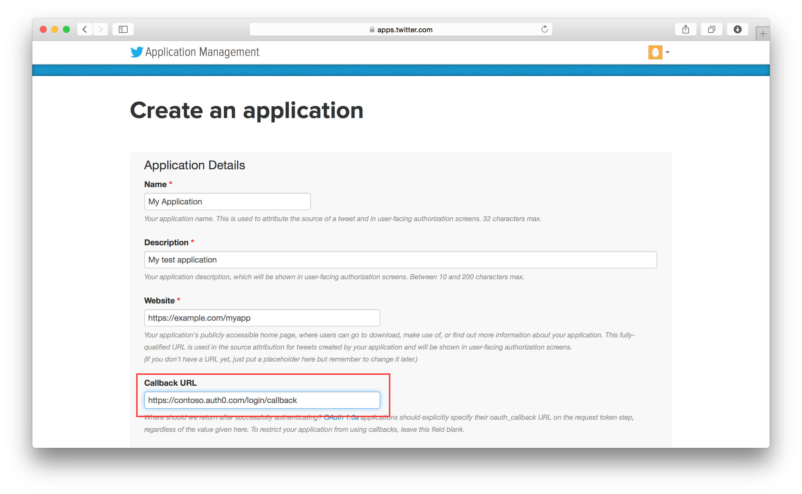
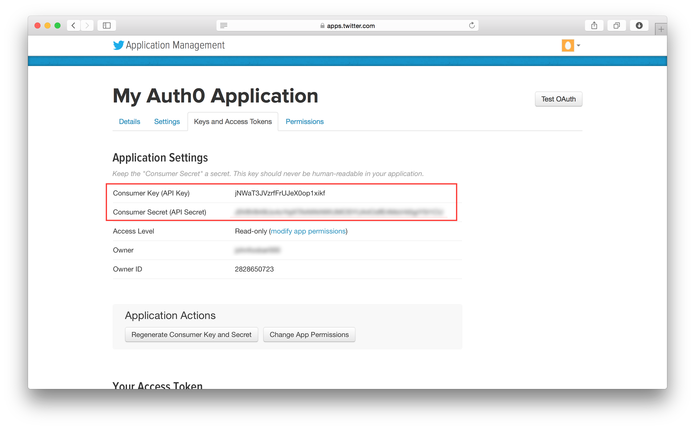
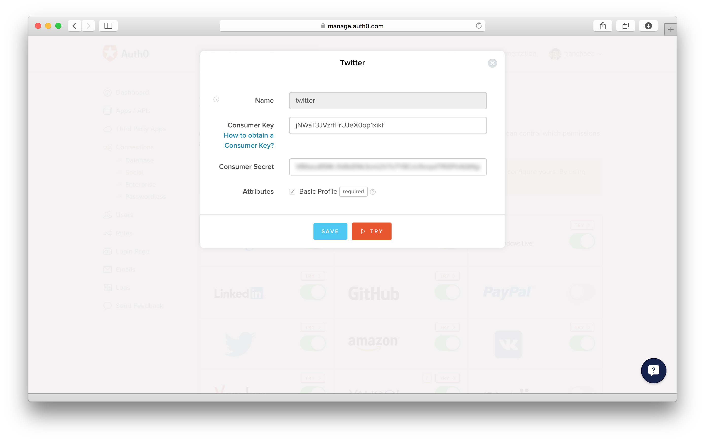

# Obtaining Consumer and Secret Keys for Twitter

To configure a Twitter connection you will need to register Auth0 with Twitter.

##1. Create a new Twitter application

Log in to Twitter, and [create a new Twitter application](https://apps.twitter.com/app/new):

Your callback URL into Auth0 is:

	https://@@account.namespace@@/login/callback

Once the application is created, go to Settings tab and make sure to check the __"Allow this application to be used to Sign in with Twitter"__ option.

---

##2. Complete information about your instance of Auth0

To reveal your consumer secret, click on **manage keys and access tokens**:

Copy these values and enter them in the [Auth0 dashboard](https://manage.auth0.com/#/connections/social):

