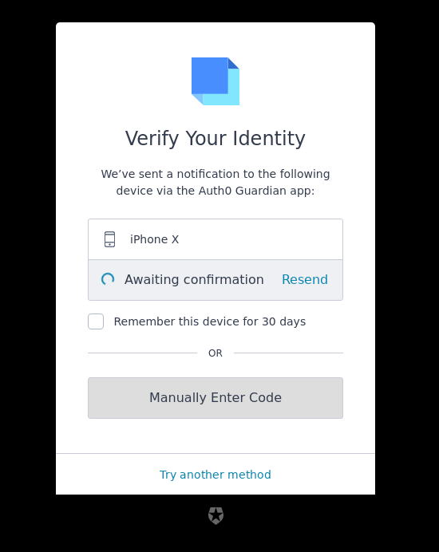

# Prompt: mfa-push

## Screen: mfa-push-welcome

  

|Key|Value|
|----------|----------|
|pageTitle|Sign up to ${clientName}|
|title|Secure Your Account|
|description|In order to continue, install the ${appName} app via the app store from your mobile device.|
|androidButtonText|Google Play|
|buttonText|Continue|
|iosButtonText|App Store|
|pickAuthenticatorText|Try another method|

## Screen: mfa-push-enrollment-qr

  

|Key|Value|
|----------|----------|
|pageTitle|Sign up to ${clientName}|
|title|Secure Your Account|
|description|Scan the QR Code below using the ${appName} app on your mobile device.|
|pickAuthenticatorText|Try another method|
|buttonText|Continue|

## Screen: mfa-push-challenge-push

  

|Key|Value|
|----------|----------|
|pageTitle|Log in to ${clientName}|
|title|Verify Your Identity|
|description|We’ve sent a notification to the following device via the ${appName} app:|
|awaitingConfirmation|Awaiting confirmation|
|buttonText|I've responded on my device|
|pickAuthenticatorText|Try another method|
|rememberMeText|Remember this device for 30 days|
|resendActionText|Resend|
|resendText|Didn't receive a notification?|
|enterOtpCode|Manually Enter Code|
|separatorText|OR|

## Screen: mfa-push-challenge-code

  

|Key|Value|
|----------|----------|
|pageTitle|Log in to ${clientName}|
|backText|Back|
|buttonText|Continue|
|description|Enter the one-time code found at the bottom of the ${appName} app.|
|pickAuthenticatorText|Try another method|
|placeholder|Enter the one-time code|
|rememberMeText|Remember this device for 30 days|
|title|Verify Your Identity|

## Screen: mfa-push-list

  

|Key|Value|
|----------|----------|
|pageTitle|Log in to ${clientName}|
|backText|Go back|
|title|Enrolled Devices|
