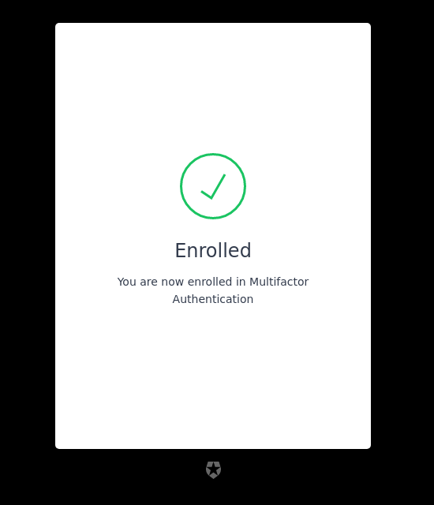
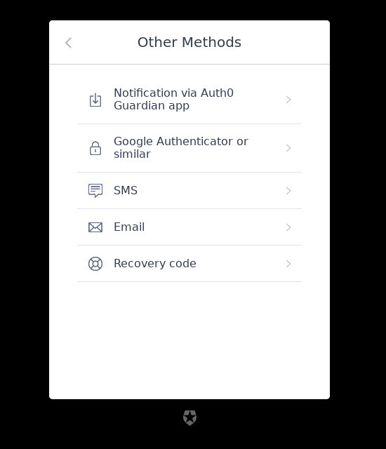

# Prompt: mfa

## Screen: mfa-enroll-result

  

|Key|Value|
|----------|----------|
|pageTitle|Secure your Account|
|enrolledTitle|Enrolled|
|enrolledDescription|You are now enrolled in Multifactor Authentication|
|invalidTicketTitle|Invalid Link|
|invalidTicketDescription|The link is invalid or has expired.|
|expiredTicketTitle|Expired Link|
|expiredTicketDescription|The link has expired.|
|alreadyUsedTitle|Already used|
|alreadyUsedDescription|This link has already been used. Please get a new link to enroll MFA.|
|alreadyEnrolledTitle|Already enrolled|
|alreadyEnrolledDescription|You are already enrolled in Multifactor Authentication. You will need to reset your MFA before being able to re-enroll.|

## Screen: mfa-login-options

  

|Key|Value|
|----------|----------|
|pageTitle|Log in to ${clientName}|
|backText|Go back|
|title|Other Methods|
|`authenticatorNames.sms`|SMS|
|`authenticatorNames.push-notification`|Notification via ${appName} app|
|`authenticatorNames.otp`|Google Authenticator or similar|
|`authenticatorNames.email`|Email|
|`authenticatorNames.recovery-code`|Recovery code|
|`authenticatorNames.duo`|Notification via DUO app|
