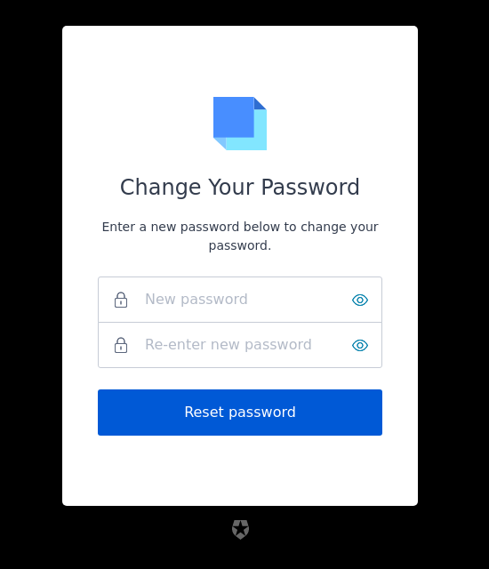

# Prompt: reset-password

## Screen: reset-password-request

  

|Key|Value|
|----------|----------|
|pageTitle|Reset Password|
|title|Forgot Your Password?|
|backToLoginLinkText|Back to <%= "${clientName}" %>|
|buttonText|Continue|
|descriptionEmail|Enter your email address and we will send you instructions to reset your password.|
|descriptionUsername|Enter your username and we will send you instructions to reset your password.|
|placeholderEmail|Email address|
|placeholderUsername|Username|

## Screen: reset-password-email

  

|Key|Value|
|----------|----------|
|pageTitle|Reset Password|
|title|Check Your Email|
|emailDescription|Please check the email address <%= "${email}" %> for instructions to reset your password.|
|resendLinkText|Resend email|
|resendText|Didn't receive an email?|
|usernameDescription|Please check the email address associated with the username <%= "${email}" %> for instructions to reset your password.|

## Screen: reset-password

  

|Key|Value|
|----------|----------|
|pageTitle|Reset Password|
|title|Change Your Password|
|description|Enter a new password below to change your password.|
|buttonText|Reset password|
|passwordPlaceholder|New password|
|reEnterpasswordPlaceholder|Re-enter new password|
|passwordSecurityText|Your password must contain:|

## Screen: reset-password-success

  

|Key|Value|
|----------|----------|
|pageTitle|Reset Password|
|eventTitle|Password Changed!|
|description|Your password has been changed successfully.|
|buttonText|Back to <%= "${clientName}" %>|

## Screen: reset-password-error

  

|Key|Value|
|----------|----------|
|pageTitle|Reset Password|
|backToLoginLinkText|Back to <%= "${clientName}" %>|
|descriptionExpired|To reset your password, return to the login page and select "Forgot Your Password" to send a new email.|
|descriptionGeneric|To reset your password, return to the login page and select "Forgot Your Password" to send a new email.|
|descriptionUsed|This link has already been used. To reset your password, return to the login page and select "Forgot Your Password" to send a new email.|
|eventTitleExpired|Link Expired|
|eventTitleGeneric|Invalid Link|
|eventTitleUsed|Invalid Link|
