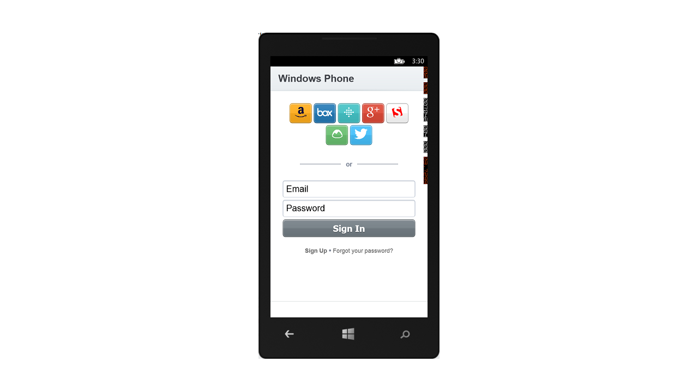

# Using Auth0 with a native Windows Phone 8 app

This tutorial explains how to integrate Auth0 with a Windows Phone app. `Auth0.WindowsPhone` helps you authenticate users with any [Auth0 supported identity provider](identityproviders).

## Tutorial

### 1. Install Auth0.WindowsPhone NuGet package

Use the NuGet Package Manager (Tools -> Library Package Manager -> Package Manager Console) to install the Auth0.WindowsPhone package, running the command:

<pre><code>Install-Package Auth0.WindowsPhone</pre></code>

### 2. Setting up the callback URL in Auth0

<div class="setup-callback">
<p>Go to the <a href="@@uiAppSettingsURL@@" target="_new">Application Settings</a> section in the Auth0 dashboard and make sure that <strong>Allowed Callback URLs</strong> contains the following value:</p>

<pre><code>https://@@account.namespace@@/mobile</pre></code>
</div>

### 3. Integration
There are three options to do the integration:

1. Using the [Auth0 Login Widget](login-widget2) inside a Web View (this is the simplest with only a few lines of code required).
2. Creating your own UI (more work, but higher control the UI and overall experience).
3. Using specific user name and password.

#### Option 1: Authentication using Login Widget

To start with, we'd recommend using the __Login Widget__. Here is a snippet of code to copy & paste on your project:

```csharp
using Auth0.SDK;

var auth0 = new Auth0Client(
    "@@account.namespace@@",
    "@@account.clientId@@");

var user = await auth0.LoginAsync();
/*
- get user email => user.Profile["email"].ToString()
- get facebook/google/twitter/etc access token => user.Profile["identities"][0]["access_token"]
- get Windows Azure AD groups => user.Profile["groups"]
- etc.
*/
```

Invoking LoginAsync without parameters will show the login widget:



#### Option 2: Authentication with your own UI

If you know which identity provider you want to use, you can add a `connection` parameter and the user will be sent straight to the specified `connection`:

```csharp
var user = await auth0.LoginAsync("auth0waadtests.onmicrosoft.com") // connection name here
```

> connection names can be found on Auth0 dashboard. E.g.: `facebook`, `linkedin`, `somegoogleapps.com`, `saml-protocol-connection`, etc.

#### Option 3: Authentication with specific user name and password (only for providers that support this)

```csharp
var user  = await auth0.LoginAsync (
    "my-db-connection",     // connection name here
    "username",             // user name
    "password")             // password

```

## Accessing user information

The `Auth0User` has the following properties:

* `Profile`: returns a `Newtonsoft.Json.Linq.JObject` object (from [Json.NET component](http://components.xamarin.com/view/json.net/)) containing all available user attributes (e.g.: `user.Profile["email"].ToString()`).
* `IdToken`: is a Json Web Token (JWT) containing all of the user attributes and it is signed with your client secret. This is useful to call your APIs and flow the user identity.
* `Auth0AccessToken`: the `access_token` that can be used to access Auth0's API. You would use this for example to [link user accounts](link-accounts).

## Logout

You can trigger a logout by doing. This will clean up the cookies of the embedded browser.

     await auth0.LogoutAsync();

**Congratulations!**
