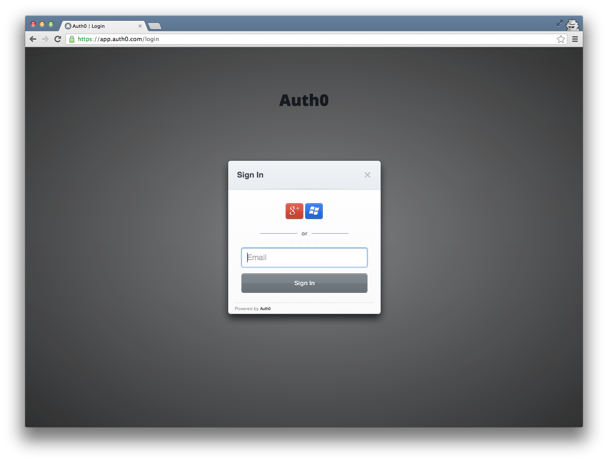
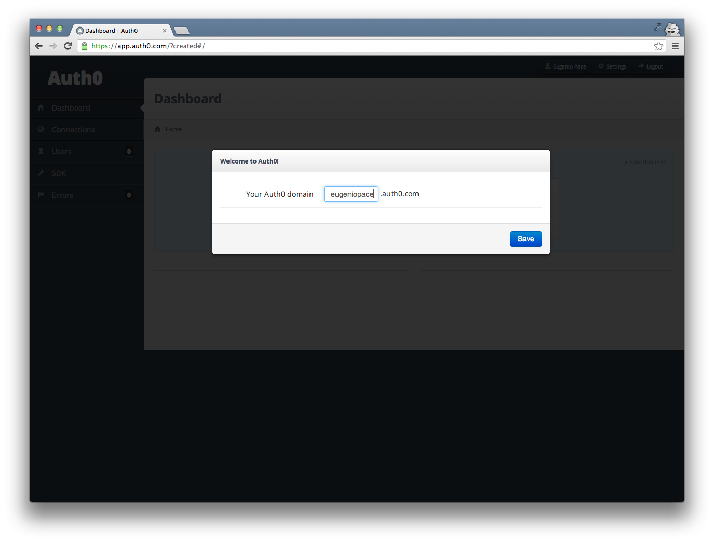
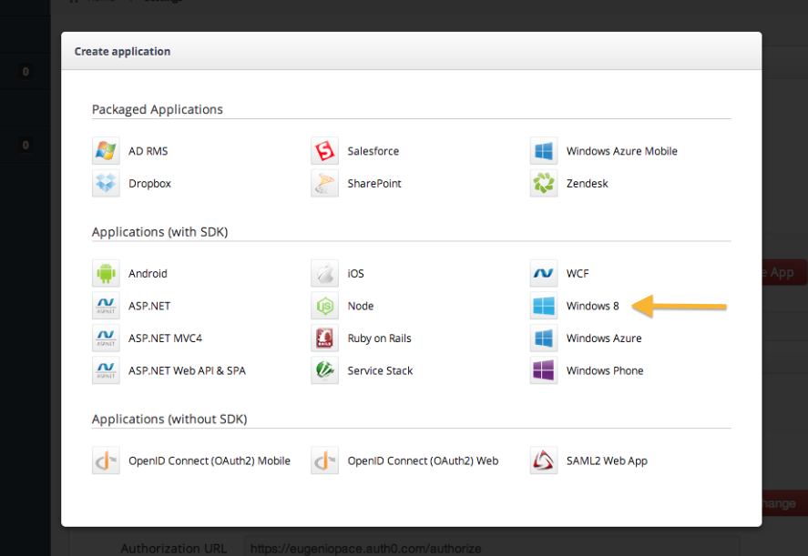
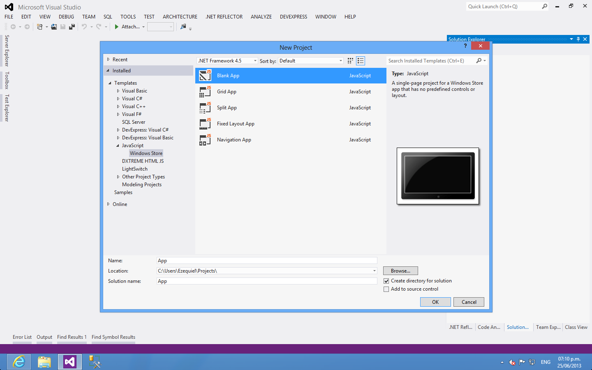
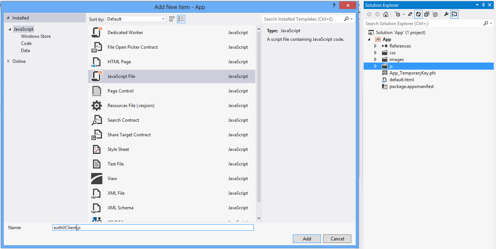
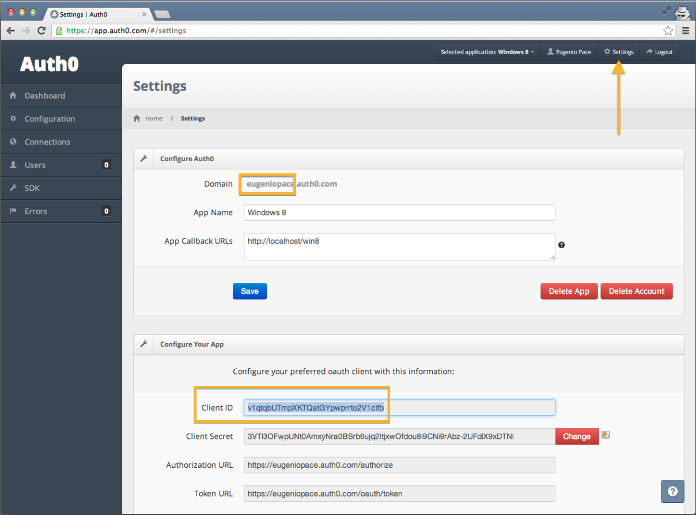
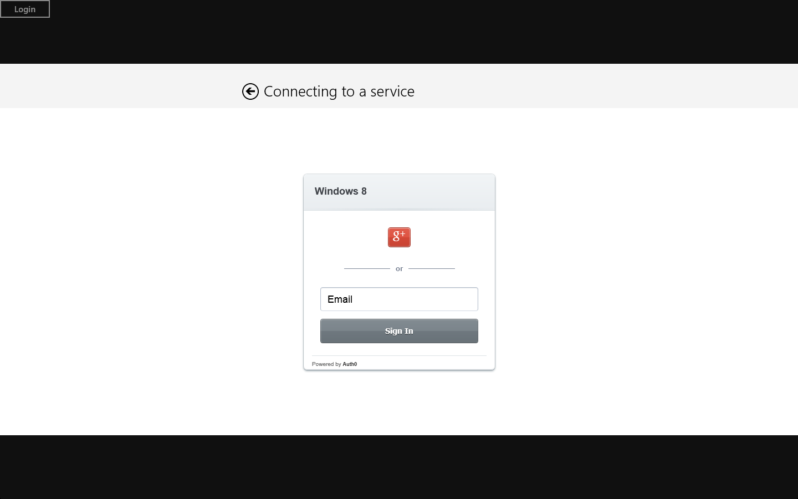
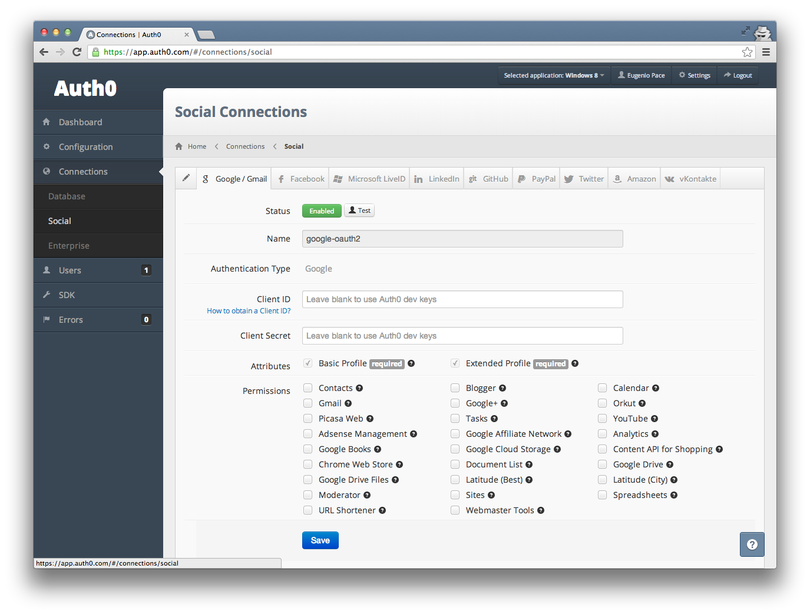
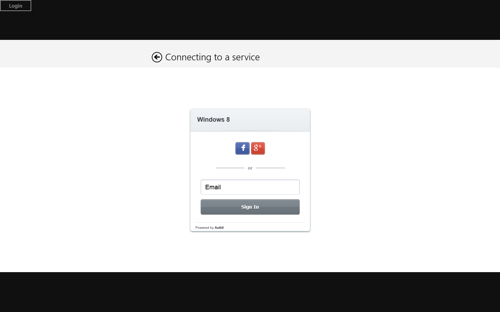
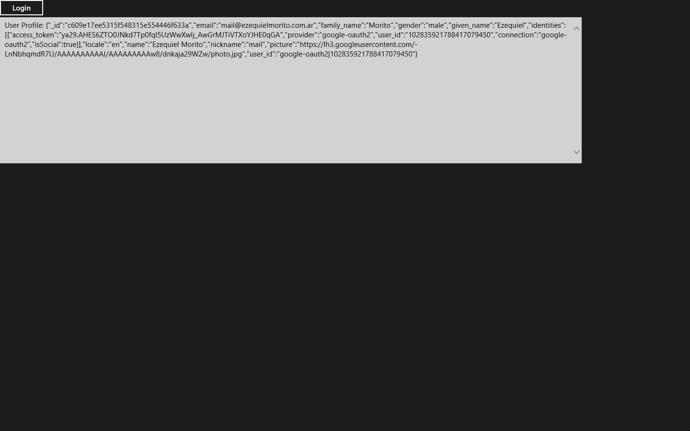

# Authenticating Users Anywhere with Auth0

## Goals

1. Build a Windows Store app that authenticates users with any identity provider (e.g. Facebook, Google, MS Account, Twitter, PayPal, LinkedIn, Office365, Google Apps, etc)

2. Once authenticated, call Auth0 API to retrieve user's information.

> The tutorial will take 10 minutes approximately. You are just 10 minutes away from the (W) token :). You shouldn't, but if you need help: http://chat.auth0.com

## Before you start

This tutorial assumes you are familiar with JavaScript & Visual Studio 2012.

## Create an Auth0 Account

1. Open an account with [Auth0](https://developers.auth0.com)
2. You can login with a Google, Github or a Microsoft Account:



3. After login, enter a name for your account. This will uniquely identify you in Auth0. We will refer to this as {YOUR_TENANT_NAME} later in the tutorial.



4. Choose the type of application you are building. Select __Windows 8__:



Keep Auth0 open. You will later need information from the dashboard to test your app.

## Build the Windows Store App

###1. Open Visual Studio 2012 and create a new blank Windows Store App:



###2. Add a basic UI to the app

Open the `default.html` file and replace `<p>Content goes here</p>` to a `button`:

```html

<button id="login">Login</button>
```


###3. Add the auth0Client.js javascript

This javascript will encapsulate all access to Auth0. Add a new file named `auth0Client.js` under the `js` folder:



And add the following code:

```javascript

(function () {
    "use strict";

    function Login() {

        var auth0Url = "https://{YOUR_TENANT_NAME}.auth0.com/authorize";

        var clientId = "{YOUR_CLIENT_ID}";
        var callbackUrl = "http://localhost/win8";

        auth0Url += "?client_id=" + clientId + "&redirect_uri=" + callbackUrl + "&response_type=token&scope=openid";

        var startUri = new Windows.Foundation.Uri(auth0Url);
        var endUri = new Windows.Foundation.Uri(callbackUrl);

        Windows.Security.Authentication.Web.WebAuthenticationBroker.authenticateAsync(
            Windows.Security.Authentication.Web.WebAuthenticationOptions.none, startUri, endUri)
            .done(function (result) {
                var access_token = result.responseData.split("#")[1].split("&")[1].split("=")[0];
            });
    }
})();
```

Replace __{YOUR TENANT NAME}__ with the name you used when you created the account with Auth0. And __{YOUR CLIENT ID}__ with the `clientId` value you can get from your settings page:



And add reference to the javaScript code in the `default.html`, including the following line in the <head> element:

```html

<script src="/js/auth0Client.js"></script>
```

###4. Wire-up UI controls to Auth0Client

Add the following code in `auth0Client.js` after `"use strict";` to handle the click event:

```javascript

var page = WinJS.UI.Pages.define("/default.html", {
    ready: function (element, options) {
        document.getElementById("login").addEventListener("click", Login, false);
    }
});
```

###5. Test the application:

When you run the application you will see the Login Screen with the __Auth0 Login Widget__:



It will show "Google" as an option to authenticate. Place a breakpoint in the `var access_token = result.responseData.split("#")[1].split("&")[1].split("=")[0];` line and complete authentication. If everything is successful, you will see the `access_token`.

###6. Enable other identity providers

Go back to [Auth0](https://app.auth0.com) and select __Connections__, __Social__:



Enable any of the providers available by clicking on the `Disabled` button.

Run the app again and you will see the providers you just enabled on the login screen:



###7. Getting user attributes

Open the `default.html` file and paste the following content after the `<button>` element:

```html

<div data-win-control="Output">
  <textarea id="auth0DebugArea" rows="15" cols="150"></textarea>
</div>
```

Open the `auth0Client.js` file, replace `var access_token = result.responseData.split("#")[1].split("&")[1].split("=")[0];` with the following code:

```javascript
var access_token = result.responseData.split("#")[1].split("&")[0];
WinJS.xhr({ url: "https://{YOUR_TENANT_NAME}.auth0.com/userinfo/?" + access_token, responseType: "json" })
    .done(function complete(result) {
        log("User Profile: " + result.responseText);
    },
          function (err) {
              log("Error in getting user profile: " + err.responseData);
          });
```

And add the following `function`:

```javascript
function log(msg) {
    document.getElementById("auth0DebugArea").value += msg + "\r\n";
}
```

Run the app again and you will see the user info after login:



## Congratulations!! Go get your token!
